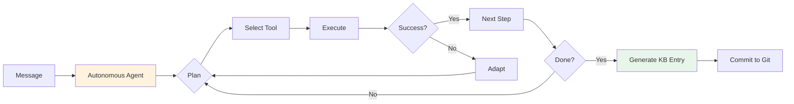

# Autonomous Agent Guide

Python-based autonomous agent with OpenAI-compatible API support for intelligent knowledge base building.

---

## Overview

The **Autonomous Agent** is a Python-based AI agent that uses OpenAI-compatible APIs to process messages and build your knowledge base. It features autonomous planning, decision-making, and tool execution capabilities.

Unlike the Qwen Code CLI agent (which uses Node.js), the autonomous agent is pure Python and works with any OpenAI-compatible API endpoint, making it flexible for custom LLM providers.

---

## Key Features

### 🤖 Autonomous Decision Making

- **Self-Planning** - Creates execution plans autonomously
- **Dynamic Tool Selection** - Chooses appropriate tools based on context
- **Iterative Refinement** - Adapts strategy based on results
- **Error Recovery** - Handles failures gracefully

### 🔧 Built-in Tools

- **Multi-Stage Search** - 3-stage search strategy (file → vector → refined)
- **Web Search** - Search the internet for additional context
- **Git Operations** - Version control for knowledge base
- **GitHub API** - Repository management
- **File Management** - Create, read, update files in KB
- **Folder Management** - Organize KB structure
- **Shell Commands** - Execute safe shell operations (optional)
- **Vector Search** - Semantic search across knowledge base

### 🔌 LLM Flexibility

- **OpenAI** - Native support for GPT models
- **Custom Endpoints** - Use any OpenAI-compatible API
- **Qwen** - Works with Qwen models via compatible API
- **Azure OpenAI** - Enterprise deployment support
- **Local Models** - Compatible with local LLM servers

### 🎯 Function Calling

- Native function calling support
- Automatic tool discovery
- Structured output generation
- Type-safe parameter passing

---

## Installation

### Prerequisites

- Python 3.11+
- Poetry (recommended) or pip
- OpenAI API key or compatible API endpoint

### Setup

1. **Install dependencies** (OpenAI library included):

```bash
poetry install
```

2. **Configure environment variables**:

```bash
# .env file
OPENAI_API_KEY=sk-...
OPENAI_BASE_URL=https://api.openai.com/v1  # Optional, for custom endpoints
```

3. **Update config.yaml**:

```yaml
AGENT_TYPE: "autonomous"
AGENT_MODEL: "gpt-3.5-turbo"
AGENT_TIMEOUT: 300
AGENT_ENABLE_WEB_SEARCH: true
AGENT_ENABLE_GIT: true
AGENT_ENABLE_FILE_MANAGEMENT: true
```

---

## Configuration

### Basic Configuration

```yaml
# config.yaml
AGENT_TYPE: "autonomous"
AGENT_MODEL: "gpt-3.5-turbo"  # or gpt-4, qwen-max, etc.
AGENT_TIMEOUT: 300  # seconds
```

### Tool Permissions

```yaml
# Enable/disable specific tools
AGENT_ENABLE_WEB_SEARCH: true
AGENT_ENABLE_GIT: true
AGENT_ENABLE_GITHUB: true
AGENT_ENABLE_SHELL: false  # Disabled by default for security
AGENT_ENABLE_FILE_MANAGEMENT: true
AGENT_ENABLE_FOLDER_MANAGEMENT: true
```

### Advanced Settings

```yaml
# Custom instruction for the agent
AGENT_INSTRUCTION: |
  You are a knowledge base curator.
  Analyze content, categorize it, and create well-structured Markdown files.

# Maximum planning iterations
AGENT_MAX_ITERATIONS: 10

# Knowledge base path
KB_PATH: ./knowledge_base
```

### Environment Variables

```env
# OpenAI Configuration
OPENAI_API_KEY=sk-...
OPENAI_BASE_URL=https://api.openai.com/v1

# Alternative: Use Qwen API
OPENAI_API_KEY=sk-...
OPENAI_BASE_URL=https://dashscope.aliyuncs.com/compatible-mode/v1

# GitHub (optional, for GitHub tools)
GITHUB_TOKEN=ghp_...
```

---

## Usage Examples

### Using with OpenAI

```yaml
# config.yaml
AGENT_TYPE: "autonomous"
AGENT_MODEL: "gpt-3.5-turbo"
```

```env
# .env
OPENAI_API_KEY=sk-proj-...
```

### Using with Qwen API

```yaml
# config.yaml
AGENT_TYPE: "autonomous"
AGENT_MODEL: "qwen-max"
```

```env
# .env
OPENAI_API_KEY=sk-...
OPENAI_BASE_URL=https://dashscope.aliyuncs.com/compatible-mode/v1
```

### Using with Azure OpenAI

```yaml
# config.yaml
AGENT_TYPE: "autonomous"
AGENT_MODEL: "gpt-35-turbo"
```

```env
# .env
OPENAI_API_KEY=your-azure-key
OPENAI_BASE_URL=https://your-resource.openai.azure.com/
```

### Using with Local LLM

```yaml
# config.yaml
AGENT_TYPE: "autonomous"
AGENT_MODEL: "local-model"
```

```env
# .env
OPENAI_API_KEY=not-needed
OPENAI_BASE_URL=http://localhost:8080/v1
```

---

## How It Works

### Processing Pipeline



### Execution Flow

1. **Receive Content**
   - Text, URLs, forwarded messages
   - Extract and parse information

2. **Autonomous Planning**
   - LLM creates execution plan
   - Decides which tools to use
   - Plans iterative steps

3. **Tool Execution**
   - Web search for context
   - Analyze content structure
   - Create folders/files
   - Git operations

4. **Iterative Refinement**
   - Evaluate results
   - Adjust strategy if needed
   - Handle errors gracefully

5. **KB Generation**
   - Create Markdown file
   - Add metadata
   - Proper categorization

6. **Version Control**
   - Git commit
   - Push to remote (if enabled)

---

## Available Tools

### Multi-Stage Search Strategy

The agent uses a 3-stage search approach to find information in the knowledge base:

**Stage 1: File Search** (`kb_search_files`)
- Search files by name patterns based on keywords
- Quick discovery of relevant files by filename

```python
tool: kb_search_files
params:
  pattern: "*gpt*.md"
```

**Stage 2: Vector Search** (`kb_vector_search`)
- Semantic search across entire knowledge base
- Finds semantically similar content

```python
tool: kb_vector_search
params:
  query: "GPT-4 architecture and capabilities"
  top_k: 7
```

**Stage 3: Refined Search** (`kb_search_content` + `kb_read_file`)
- Search specific terms in promising files
- Read most relevant files
- Optional: Another targeted vector search with refined query

```python
tool: kb_search_content
params:
  query: "architecture"
  file_pattern: "gpt*.md"

tool: kb_read_file
params:
  paths: ["ai/models/gpt4.md"]
```

### Web Search Tool

Search the internet for additional context.

```python
# Automatically used when agent needs more information
tool: web_search
params:
  query: "machine learning basics"
```

### File Management Tools

Create and manage files in the knowledge base.

```python
# Create new file
tool: file_create
params:
  path: "topics/ai/neural-networks.md"
  content: "# Neural Networks\n\n..."
```

### Folder Management Tools

Organize knowledge base structure.

```python
# Create folder
tool: folder_create
params:
  path: "topics/new-category"
```

### Git Tools

Version control operations.

```python
# Safe git commands only
tool: git_command
params:
  command: "git status"
```

### GitHub Tools

Repository management (requires GITHUB_TOKEN).

```python
# GitHub operations
tool: github_api
params:
  endpoint: "/repos/:owner/:repo/issues"
  method: "GET"
```

---

## Performance

### Processing Time

| Content Type | Typical Time | With Web Search |
|--------------|--------------|-----------------|
| Short text (< 500 chars) | 5-10s | 10-20s |
| Medium text (500-2000) | 10-30s | 20-60s |
| Long text (> 2000) | 30-90s | 60-180s |
| With URLs | 15-45s | 30-120s |

### Factors Affecting Speed

- **Model Selection** - GPT-4 slower but higher quality
- **Tool Usage** - Web search adds latency
- **Content Complexity** - More analysis = longer time
- **API Latency** - Network and API response time
- **Iterations** - Complex tasks need more planning steps

---

## Best Practices

### Model Selection

**GPT-3.5-turbo**

- ✅ Fast response time
- ✅ Cost-effective
- ✅ Good for simple content
- ❌ Less sophisticated analysis

**GPT-4**

- ✅ Best quality
- ✅ Complex reasoning
- ✅ Better categorization
- ❌ Slower and more expensive

**Qwen-max**

- ✅ Free tier available
- ✅ Good quality
- ✅ Chinese language support
- ❌ Requires Qwen API

### Tool Configuration

**Enable for Production:**

```yaml
AGENT_ENABLE_WEB_SEARCH: true
AGENT_ENABLE_GIT: true
AGENT_ENABLE_FILE_MANAGEMENT: true
AGENT_ENABLE_FOLDER_MANAGEMENT: true
VECTOR_SEARCH_ENABLED: true  # Enable vector search for multi-stage retrieval
```

**Disable for Security:**

```yaml
AGENT_ENABLE_SHELL: false  # Keep disabled unless needed
AGENT_ENABLE_GITHUB: false  # If not using GitHub API
```

### Multi-Stage Search Configuration

For optimal search performance, configure vector search:

```yaml
# Vector search settings
VECTOR_SEARCH_ENABLED: true
VECTOR_SEARCH_PROVIDER: "sentence_transformers"  # or "openai"
VECTOR_SEARCH_MODEL: "all-MiniLM-L6-v2"  # or "text-embedding-3-small"
VECTOR_SEARCH_BACKEND: "faiss"  # or "qdrant"
VECTOR_SEARCH_TOP_K: 7  # Number of results to return
```

### Custom Instructions

Tailor agent behavior with custom instructions:

```yaml
AGENT_INSTRUCTION: |
  You are a scientific paper curator.

  For each paper:
  1. Extract: title, authors, abstract, key findings
  2. Categorize by research field
  3. Add relevant tags
  4. Create bibliography entry

  Use clear, academic language.
```

### Connections (Связи)

- When creating relations, link only to existing files from the KB (skip files created in the same run).
- Provide a short, meaningful description (1–2 sentences) for each relation that explains the connection type (similarity, dependency, part-whole, alternative, sequence, overlapping tags).

---

## Troubleshooting

### Agent Not Working

**Problem:** Agent fails to start or process messages

**Solutions:**

1. Check API key: `echo $OPENAI_API_KEY`
2. Verify base URL if using custom endpoint
3. Test API connection: `curl $OPENAI_BASE_URL/models`
4. Check logs: `tail -f logs/bot.log`

### Slow Processing

**Problem:** Agent takes too long to process

**Solutions:**

1. Use faster model (GPT-3.5 instead of GPT-4)
2. Disable web search if not needed
3. Reduce `AGENT_MAX_ITERATIONS`
4. Check network latency to API endpoint

### Poor Quality Results

**Problem:** Agent produces low-quality KB entries

**Solutions:**

1. Upgrade to GPT-4 or better model
2. Enable web search for more context
3. Customize `AGENT_INSTRUCTION` for your use case
4. Increase `AGENT_TIMEOUT` for complex content

### API Errors

**Problem:** OpenAI API errors (rate limits, etc.)

**Solutions:**

1. Check API quota and billing
2. Implement retry logic (already built-in)
3. Consider using different endpoint
4. Monitor rate limits in dashboard

---

## Comparison with Other Agents

### vs. Qwen Code CLI

| Feature | Autonomous | Qwen CLI |
|---------|-----------|----------|
| **Language** | Python | Node.js |
| **Setup** | pip install | npm install |
| **API** | OpenAI-compatible | Qwen specific |
| **Flexibility** | High | Medium |
| **Free Tier** | Depends on API | 2000/day |
| **Vision** | Depends on model | ✅ Yes |

**Choose Autonomous when:**

- Python-only environment
- Need custom LLM provider
- Already have OpenAI API
- Want maximum flexibility

**Choose Qwen CLI when:**

- Want free tier (2000/day)
- Node.js is available
- Vision support is required
- Official Qwen integration preferred

### vs. Stub Agent

| Feature | Autonomous | Stub |
|---------|-----------|------|
| **AI** | ✅ Yes | ❌ No |
| **Tools** | ✅ Yes | ❌ No |
| **Quality** | High | Basic |
| **Speed** | Medium | Fast |
| **Cost** | API cost | Free |

**Use Autonomous for production, Stub for testing.**

---

## Advanced Features

### Custom LLM Connectors

Implement custom connector for any LLM:

```python
from src.agents.llm_connectors import BaseLLMConnector

class CustomConnector(BaseLLMConnector):
    async def generate(self, messages, tools=None):
        # Your custom implementation
        pass
```

### Tool Registration

Register custom tools programmatically:

```python
agent.register_tool("my_tool", my_tool_function)
```

### Context Management

Agent maintains execution context:

```python
context = AgentContext(task="Process message")
context.add_execution(execution)
context.get_history()
```

---

## Example Code

See [examples/autonomous_agent_example.py](https://github.com/ArtyomZemlyak/tg-note/blob/main/examples/autonomous_agent_example.py) for complete examples:

- Basic usage
- Custom instructions
- Error handling
- Tool registration

---

## See Also

- [Agent Overview](overview.md)
- [Qwen Code CLI Agent](qwen-code-cli.md)
- [Stub Agent](stub-agent.md)
- [Configuration Reference](../reference/configuration.md)
