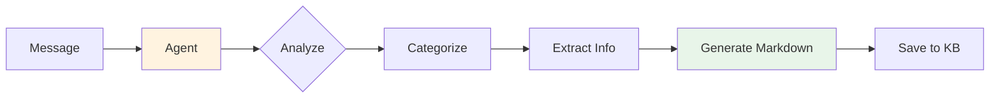
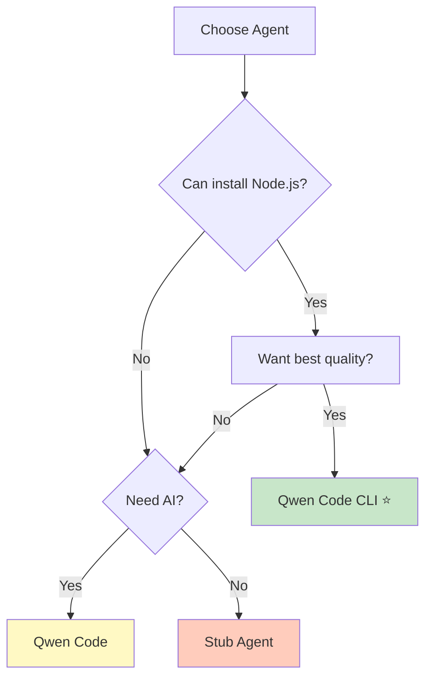

# Agent System Overview

Understanding the AI agent system in tg-note.

---

## What are Agents?

Agents are AI-powered systems that process your messages and transform them into structured knowledge base entries. They analyze content, categorize it, extract key information, and generate well-formatted Markdown files.

---

## Available Agents

tg-note supports three types of agents, each with different capabilities and use cases.

### Comparison Table

| Feature | Qwen Code CLI | Qwen Code | Stub |
|---------|---------------|-----------|------|
| **AI Processing** | ✅ Advanced | ✅ Good | ❌ Basic |
| **Auto Planning** | ✅ Yes | ⚠️ Limited | ❌ No |
| **Web Search** | ✅ Built-in | ✅ Custom | ❌ No |
| **Git Operations** | ✅ Built-in | ✅ Custom | ❌ No |
| **External Dependencies** | Node.js | None | None |
| **Free Tier** | 2000/day | API costs | Free |
| **Best For** | Production | Custom needs | Testing/MVP |

---

## 1. Qwen Code CLI ⭐ Recommended

The most powerful agent using the official Qwen Code CLI tool.

### Features

- ✅ **Advanced AI Processing** - Qwen3-Coder models
- ✅ **Automatic Planning** - Creates and executes TODO plans
- ✅ **Built-in Tools** - Web search, Git, GitHub, Shell
- ✅ **Vision Support** - Can analyze images
- ✅ **Free Tier** - 2000 requests/day, 60 req/min

### Installation

```bash
# Install Node.js 20+
npm install -g @qwen-code/qwen-code@latest

# Authenticate
qwen

# Configure
AGENT_TYPE: "qwen_code_cli"
```

### When to Use

- ✅ Production deployments
- ✅ Need best quality output
- ✅ Want automatic planning
- ✅ Can install Node.js

[Full Documentation →](qwen-code-cli.md)

---

## 2. Qwen Code Agent

Pure Python agent with customizable tools.

### Features

- ✅ **Python Native** - No Node.js required
- ✅ **Custom Tools** - Build your own tool integrations
- ✅ **Flexible** - Full control over processing
- ⚠️ **API Costs** - Requires Qwen API key

### Configuration

```yaml
AGENT_TYPE: "qwen_code"
AGENT_MODEL: "qwen-max"
```

### When to Use

- ✅ Need Python-only solution
- ✅ Custom tool requirements
- ✅ Full control over agent behavior
- ❌ Can't install Node.js

[Full Documentation →](qwen-code.md)

---

## 3. Stub Agent

Simple testing agent without AI.

### Features

- ✅ **Fast** - No API calls
- ✅ **Simple** - Basic categorization
- ✅ **No Dependencies** - Works out of the box
- ❌ **Limited** - No AI analysis

### Configuration

```yaml
AGENT_TYPE: "stub"
```

### When to Use

- ✅ Testing and development
- ✅ MVP/prototype
- ✅ No API keys available
- ❌ Production use

[Full Documentation →](stub-agent.md)

---

## How Agents Work

### Processing Pipeline



### Agent Workflow

1. **Receive Content**
   - Text messages
   - URLs
   - Forwarded posts
   - Media

2. **Analyze**
   - Understand topic
   - Extract key points
   - Identify category

3. **Process**
   - Search for context (if enabled)
   - Gather additional info
   - Structure content

4. **Generate**
   - Create Markdown file
   - Add metadata
   - Format properly

5. **Save**
   - Write to KB
   - Commit to Git
   - Notify user

---

## Choosing an Agent

### Decision Tree



### Recommendations

#### For Production
→ **Qwen Code CLI**

- Best quality results
- Automatic planning
- Built-in tools
- Free tier available

#### For Custom Needs
→ **Qwen Code**

- Full Python control
- Custom tool integration
- Flexible configuration

#### For Testing
→ **Stub Agent**

- Quick setup
- No dependencies
- Fast iteration

---

## Agent Configuration

### Global Settings

Set in `config.yaml`:

```yaml
# Agent Selection
AGENT_TYPE: "qwen_code_cli"

# Common Settings
AGENT_MODEL: "qwen-max"
AGENT_TIMEOUT: 300

# Tool Permissions
AGENT_ENABLE_WEB_SEARCH: true
AGENT_ENABLE_GIT: true
AGENT_ENABLE_GITHUB: true
AGENT_ENABLE_SHELL: false
```

### Per-User Settings

Users can override via Telegram:

```
/agentsettings
# Or
/setsetting AGENT_TIMEOUT 600
```

---

## Agent Capabilities

### Content Analysis

All agents can:
- Extract text content
- Identify topics
- Generate titles
- Create metadata

Advanced agents (Qwen) add:
- Deep semantic understanding
- Context enrichment
- Smart categorization
- Quality summaries

### Tool Usage

| Tool | Qwen CLI | Qwen Code | Stub |
|------|----------|-----------|------|
| Web Search | ✅ | ✅ | ❌ |
| Git Ops | ✅ | ✅ | ❌ |
| GitHub API | ✅ | ✅ | ❌ |
| Shell | ✅ | ⚠️ | ❌ |
| Vision | ✅ | ❌ | ❌ |

---

## Performance

### Typical Processing Time

| Agent | Short Text | Medium Text | Long Text |
|-------|------------|-------------|-----------|
| **Qwen CLI** | 5-15s | 15-45s | 45-120s |
| **Qwen Code** | 3-10s | 10-30s | 30-90s |
| **Stub** | <1s | <1s | <1s |

### Factors Affecting Speed

- Content length
- URL complexity
- Web search usage
- API response time
- Network latency

---

## See Also

- [Qwen Code CLI Guide](qwen-code-cli.md)
- [Qwen Code Agent Guide](qwen-code.md)
- [Autonomous Agent Guide](autonomous-agent.md)
- [Stub Agent Reference](stub-agent.md)
