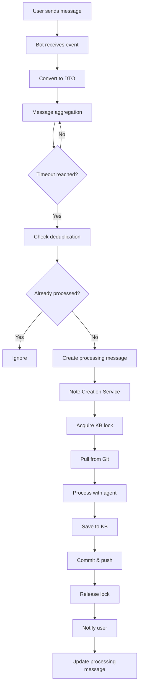
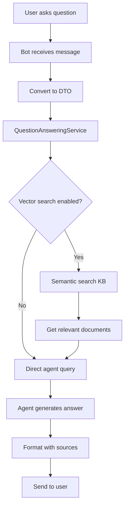
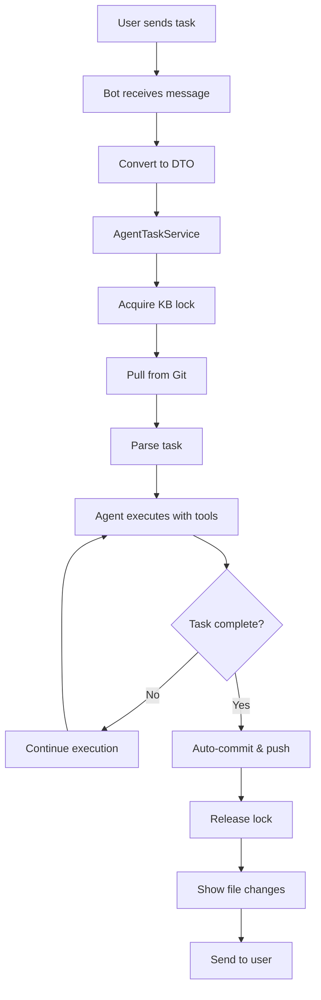
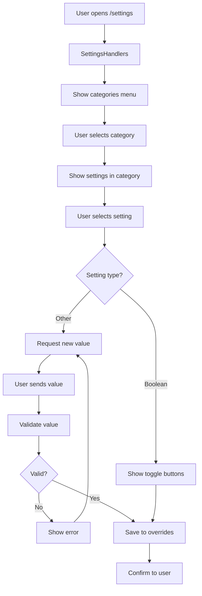
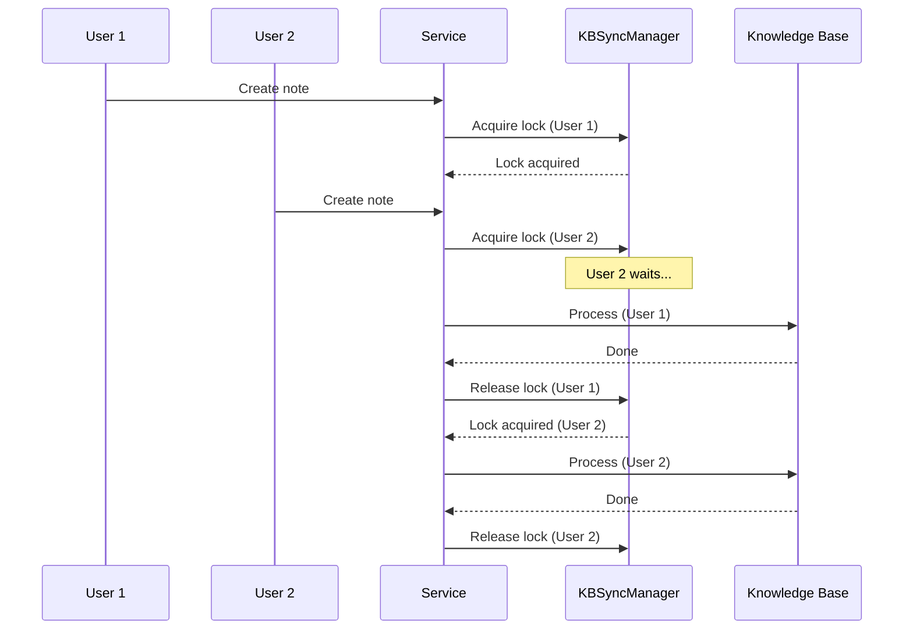

# Data Flow Architecture

## Overview

This document describes the step-by-step data flow through the tg-note system for different operations. Understanding these flows is essential for debugging, optimization, and extending the system.

## Note Creation Flow

### High-Level Flow



### Detailed Step-by-Step Flow

#### Phase 1: Message Reception (Bot Layer)

**Components**: `TelegramBotAdapter`, `BotHandlers`, `MessageMapper`

```
┌─────────────────────────────────────────────────────────────┐
│ 1. Telegram sends update to bot webhook/polling             │
└────────────────────────────┬────────────────────────────────┘
                             │
                             ▼
┌─────────────────────────────────────────────────────────────┐
│ 2. TelegramBotAdapter.message_handler() receives update     │
│    - Validates user (check ALLOWED_USER_IDS)                │
│    - Extracts message data                                  │
└────────────────────────────┬────────────────────────────────┘
                             │
                             ▼
┌─────────────────────────────────────────────────────────────┐
│ 3. MessageMapper.from_telegram_message()                    │
│    - Creates IncomingMessageDTO                             │
│    - Extracts: message_id, chat_id, user_id, text, etc.    │
│    - Handles: text, photo, document, forwarded              │
└────────────────────────────┬────────────────────────────────┘
                             │
                             ▼
                    IncomingMessageDTO
```

**Data Format (IncomingMessageDTO)**:

```python
{
    "message_id": 12345,
    "chat_id": 67890,
    "user_id": 123,
    "text": "Important article about AI...",
    "content_type": "text",  # or "photo", "document"
    "timestamp": 1634567890,
    "forwarded_from": {
        "id": 456,
        "title": "AI News Channel"
    },  # Optional
    "media": [
        {
            "type": "photo",
            "file_id": "AgACAgIAAxk...",
            "caption": "Figure 1: Neural network"
        }
    ]  # Optional
}
```

#### Phase 2: Message Aggregation (Service Layer)

**Components**: `MessageProcessor`, `MessageAggregator`

```
┌─────────────────────────────────────────────────────────────┐
│ 4. MessageProcessor.process_message(dto)                    │
│    - Checks current mode (note/ask/agent)                   │
│    - Routes to MessageAggregator                            │
└────────────────────────────┬────────────────────────────────┘
                             │
                             ▼
┌─────────────────────────────────────────────────────────────┐
│ 5. MessageAggregator.add_message(dto)                       │
│    - Stores message in buffer                               │
│    - Starts/resets 30s timer                                │
│    - Groups related messages by user                        │
└────────────────────────────┬────────────────────────────────┘
                             │
                             │ (wait 30s or explicit trigger)
                             │
                             ▼
┌─────────────────────────────────────────────────────────────┐
│ 6. MessageAggregator._process_group()                       │
│    - Combines all buffered messages                         │
│    - Extracts combined text                                 │
│    - Collects all media                                     │
│    - Generates hash for deduplication                       │
└────────────────────────────┬────────────────────────────────┘
                             │
                             ▼
                      MessageGroup
```

**Data Format (MessageGroup)**:

```python
{
    "messages": [dto1, dto2, dto3],  # List of IncomingMessageDTOs
    "combined_text": "Full text from all messages...",
    "media": [
        {"type": "photo", "file_id": "...", "caption": "..."},
        {"type": "document", "file_id": "...", "filename": "paper.pdf"}
    ],
    "hash": "sha256_hash_of_content",
    "user_id": 123,
    "chat_id": 67890,
    "timestamp": 1634567890
}
```

#### Phase 3: Deduplication Check

**Components**: `ProcessingTracker`

```
┌─────────────────────────────────────────────────────────────┐
│ 7. ProcessingTracker.is_processed(hash)                     │
│    - Checks data/processed.json                             │
│    - Returns True if already processed                      │
└────────────────────────────┬────────────────────────────────┘
                             │
                             ▼
                    ┌────────┴────────┐
                    │                 │
                 Already          Not Processed
                Processed              │
                    │                  │
                    ▼                  ▼
            [Stop Processing]   [Continue]
```

**Data Format (processed.json)**:

```json
{
  "hashes": {
    "sha256_abc123...": {
      "timestamp": 1634567890,
      "user_id": 123,
      "content_preview": "Important article about..."
    }
  },
  "stats": {
    "total_processed": 42,
    "users": {
      "123": 15,
      "456": 27
    }
  }
}
```

#### Phase 4: Note Creation Service

**Components**: `NoteCreationService`, `BaseKBService`

```
┌─────────────────────────────────────────────────────────────┐
│ 8. Create "Processing..." message                           │
│    - bot.send_message(chat_id, "⏳ Processing...")          │
│    - Store message_id for later editing                     │
└────────────────────────────┬────────────────────────────────┘
                             │
                             ▼
┌─────────────────────────────────────────────────────────────┐
│ 9. NoteCreationService.create_note()                        │
│    - Validate user KB exists                                │
│    - Get KB path                                            │
└────────────────────────────┬────────────────────────────────┘
                             │
                             ▼
┌─────────────────────────────────────────────────────────────┐
│ 10. Setup Git operations (BaseKBService)                    │
│     - Load user credentials                                 │
│     - Initialize GitOperations                              │
│     - Configure remote authentication                       │
└────────────────────────────┬────────────────────────────────┘
                             │
                             ▼
┌─────────────────────────────────────────────────────────────┐
│ 11. Determine agent working directory (BaseKBService)       │
│     - If KB_TOPICS_ONLY=true: kb_path/topics/               │
│     - If KB_TOPICS_ONLY=false: kb_path/                     │
└────────────────────────────┬────────────────────────────────┘
                             │
                             ▼
┌─────────────────────────────────────────────────────────────┐
│ 12. KBSyncManager.with_kb_lock(kb_path)                     │
│     - Acquire async lock (in-process)                       │
│     - Acquire file lock (cross-process)                     │
│     - Wait if another user is working (queue)               │
└────────────────────────────┬────────────────────────────────┘
                             │
                             ▼
                     Lock Acquired ✓
```

#### Phase 5: Git Synchronization

**Components**: `GitOperations`

```
┌─────────────────────────────────────────────────────────────┐
│ 13. GitOperations.pull()                                    │
│     - Check for uncommitted changes                         │
│     - Validate remote configured                            │
│     - Execute: git pull origin main                         │
└────────────────────────────┬────────────────────────────────┘
                             │
                             ▼
                    ┌────────┴────────┐
                    │                 │
              Pull Success      Pull Failed
                    │                 │
                    │                 ▼
                    │         [Handle Error]
                    │         - Merge conflict
                    │         - No remote
                    │         - Auth error
                    ▼
              [Continue]
```

#### Phase 6: Agent Processing

**Components**: `AgentFactory`, Agent implementations

```
┌─────────────────────────────────────────────────────────────┐
│ 14. Edit processing message                                 │
│     - bot.edit_message_text(                                │
│         "🤖 Analyzing with AI agent..."                     │
│       )                                                      │
└────────────────────────────┬────────────────────────────────┘
                             │
                             ▼
┌─────────────────────────────────────────────────────────────┐
│ 15. AgentFactory.get_agent(user_id)                         │
│     - Get or create cached agent instance                   │
│     - Configure agent tools                                 │
│     - Set working directory                                 │
└────────────────────────────┬────────────────────────────────┘
                             │
                             ▼
┌─────────────────────────────────────────────────────────────┐
│ 16. Check rate limit (BaseKBService)                        │
│     - Check user's last request time                        │
│     - Enforce rate limit (prevent API abuse)                │
└────────────────────────────┬────────────────────────────────┘
                             │
                             ▼
┌─────────────────────────────────────────────────────────────┐
│ 17. Agent.process(messages, user_id, kb_path)               │
│     - Prepare messages for agent                            │
│     - Add system prompt                                     │
│     - Add KB structure context                              │
│     - Call LLM API                                          │
│     - Parse response                                        │
└────────────────────────────┬────────────────────────────────┘
                             │
                             ▼
                    Agent Response
```

**Data Format (Agent Input)**:

```python
[
    {
        "role": "system",
        "content": "You are an AI assistant helping to organize a knowledge base..."
    },
    {
        "role": "user",
        "content": "Analyze and create a structured note:\n\nImportant article about AI..."
    }
]
```

**Data Format (Agent Response)**:

```python
{
    "content": "# Neural Networks Breakthrough\n\n## Summary\n...",
    "category": "ai",
    "files_created": ["topics/ai/2025-10-19-neural-networks.md"],
    "files_edited": [],
    "files_deleted": [],
    "folders_created": ["topics/ai"],
    "links": [
        {
            "source": "topics/ai/2025-10-19-neural-networks.md",
            "target": "topics/ai/deep-learning.md",
            "type": "related"
        }
    ],
    "metadata": {
        "agent_type": "autonomous",
        "processing_time": 5.2,
        "tokens_used": 1500
    }
}
```

#### Phase 7: File System Operations

**Components**: Agent tools, KB Layer

```
┌─────────────────────────────────────────────────────────────┐
│ 18. Agent creates files (via tools)                         │
│     - file_tool.create_file(path, content)                  │
│     - Validates path (no traversal)                         │
│     - Ensures directory exists                              │
│     - Writes content atomically                             │
└────────────────────────────┬────────────────────────────────┘
                             │
                             ▼
┌─────────────────────────────────────────────────────────────┐
│ 19. Update KB index (if configured)                         │
│     - Regenerate topics/index.md                            │
│     - Update links                                          │
└────────────────────────────┬────────────────────────────────┘
                             │
                             ▼
                    Files Written ✓
```

**File System State**:

```
knowledge_base/
├── topics/
│   ├── ai/
│   │   ├── 2025-10-19-neural-networks.md  ← NEW
│   │   ├── deep-learning.md
│   │   └── index.md  ← UPDATED
│   └── index.md  ← UPDATED
└── index.md  ← UPDATED
```

#### Phase 8: Git Commit and Push

**Components**: `GitOperations`, `BaseKBService`

```
┌─────────────────────────────────────────────────────────────┐
│ 20. BaseKBService._auto_commit_and_push()                   │
│     - git add <files>                                       │
│     - git commit -m "Add: Neural networks article"         │
└────────────────────────────┬────────────────────────────────┘
                             │
                             ▼
┌─────────────────────────────────────────────────────────────┐
│ 21. GitOperations.push()                                    │
│     - git push origin main                                  │
│     - Handle authentication                                 │
│     - Retry on network errors                               │
└────────────────────────────┬────────────────────────────────┘
                             │
                             ▼
                    ┌────────┴────────┐
                    │                 │
              Push Success      Push Failed
                    │                 │
                    │                 ▼
                    │         [Log Error]
                    │         [Notify User]
                    ▼
              [Continue]
```

#### Phase 9: Lock Release and Notification

**Components**: `KBSyncManager`, `NoteCreationService`

```
┌─────────────────────────────────────────────────────────────┐
│ 22. Release KB locks                                        │
│     - Release file lock                                     │
│     - Release async lock                                    │
│     - Next user can proceed                                 │
└────────────────────────────┬────────────────────────────────┘
                             │
                             ▼
┌─────────────────────────────────────────────────────────────┐
│ 23. Format success message (BaseKBService)                  │
│     - Created files with GitHub links                       │
│     - Related notes/links                                   │
│     - Processing time                                       │
└────────────────────────────┬────────────────────────────────┘
                             │
                             ▼
┌─────────────────────────────────────────────────────────────┐
│ 24. Edit processing message to final result                 │
│     - bot.edit_message_text(chat_id, msg_id, result)       │
│     - Add inline buttons (view, edit, delete)               │
└────────────────────────────┬────────────────────────────────┘
                             │
                             ▼
┌─────────────────────────────────────────────────────────────┐
│ 25. Mark as processed (ProcessingTracker)                   │
│     - Add hash to processed.json                            │
│     - Update statistics                                     │
└─────────────────────────────────────────────────────────────┘
```

**Final User Notification**:

```
✅ Note created successfully!

📝 Created files:
• topics/ai/2025-10-19-neural-networks.md

🔗 Related notes:
• Deep Learning Basics

⏱ Processing time: 5.2s

[View on GitHub] [Edit] [Delete]
```

## Question Answering Flow (/ask mode)

### High-Level Flow



### Detailed Flow

```
┌─────────────────────────────────────────────────────────────┐
│ 1. User sends question in /ask mode                         │
└────────────────────────────┬────────────────────────────────┘
                             │
                             ▼
┌─────────────────────────────────────────────────────────────┐
│ 2. MessageProcessor routes to QuestionAnsweringService      │
└────────────────────────────┬────────────────────────────────┘
                             │
                             ▼
┌─────────────────────────────────────────────────────────────┐
│ 3. (Optional) VectorSearchManager.search(query)             │
│    - Embed query                                            │
│    - Search vector store                                    │
│    - Return top-k documents                                 │
└────────────────────────────┬────────────────────────────────┘
                             │
                             ▼
┌─────────────────────────────────────────────────────────────┐
│ 4. Read relevant KB files                                   │
│    - KB reading tools                                       │
│    - Extract file contents                                  │
└────────────────────────────┬────────────────────────────────┘
                             │
                             ▼
┌─────────────────────────────────────────────────────────────┐
│ 5. Agent generates answer                                   │
│    - System prompt: "Answer based on KB content"            │
│    - User question + KB context                             │
│    - LLM generates answer                                   │
└────────────────────────────┬────────────────────────────────┘
                             │
                             ▼
┌─────────────────────────────────────────────────────────────┐
│ 6. Format answer with sources                               │
│    - Answer text                                            │
│    - Source files (GitHub links)                            │
│    - Confidence score                                       │
└────────────────────────────┬────────────────────────────────┘
                             │
                             ▼
┌─────────────────────────────────────────────────────────────┐
│ 7. Send to user                                             │
└─────────────────────────────────────────────────────────────┘
```

**User Notification**:

```
🤔 Answer:

Neural networks are computational models inspired by biological neural
networks. They consist of layers of interconnected nodes (neurons) that
process information...

📚 Sources:
• topics/ai/2025-10-19-neural-networks.md
• topics/ai/deep-learning.md

⏱ Processing time: 3.1s
```

## Agent Task Flow (/agent mode)

### High-Level Flow



### Detailed Flow

```
┌─────────────────────────────────────────────────────────────┐
│ 1. User sends task request in /agent mode                   │
│    Example: "Find all notes about AI and create summary"    │
└────────────────────────────┬────────────────────────────────┘
                             │
                             ▼
┌─────────────────────────────────────────────────────────────┐
│ 2. MessageProcessor routes to AgentTaskService              │
└────────────────────────────┬────────────────────────────────┘
                             │
                             ▼
┌─────────────────────────────────────────────────────────────┐
│ 3. Acquire KB lock (same as note creation)                  │
│    - Async lock                                             │
│    - File lock                                              │
└────────────────────────────┬────────────────────────────────┘
                             │
                             ▼
┌─────────────────────────────────────────────────────────────┐
│ 4. Pull latest from Git                                     │
└────────────────────────────┬────────────────────────────────┘
                             │
                             ▼
┌─────────────────────────────────────────────────────────────┐
│ 5. Parse and understand task                                │
│    - Agent analyzes task                                    │
│    - Plans steps                                            │
│    - Selects tools                                          │
└────────────────────────────┬────────────────────────────────┘
                             │
                             ▼
┌─────────────────────────────────────────────────────────────┐
│ 6. Agent autonomous execution loop                          │
│    Iteration 1:                                             │
│      - Tool: search_kb("AI")                                │
│      - Result: [file1.md, file2.md, ...]                   │
│    Iteration 2:                                             │
│      - Tool: read_file("file1.md")                          │
│      - Result: content...                                   │
│    Iteration 3:                                             │
│      - Tool: create_file("summary.md", content)             │
│      - Result: file created                                 │
│    ...                                                       │
│    Final: Task complete                                     │
└────────────────────────────┬────────────────────────────────┘
                             │
                             ▼
┌─────────────────────────────────────────────────────────────┐
│ 7. Collect file changes                                     │
│    - files_created: ["topics/summaries/ai-summary.md"]      │
│    - files_edited: ["topics/index.md"]                      │
│    - files_deleted: []                                      │
└────────────────────────────┬────────────────────────────────┘
                             │
                             ▼
┌─────────────────────────────────────────────────────────────┐
│ 8. Auto-commit and push                                     │
│    - git add .                                              │
│    - git commit -m "Agent: Create AI summary"               │
│    - git push origin main                                   │
└────────────────────────────┬────────────────────────────────┘
                             │
                             ▼
┌─────────────────────────────────────────────────────────────┐
│ 9. Release KB lock                                          │
└────────────────────────────┬────────────────────────────────┘
                             │
                             ▼
┌─────────────────────────────────────────────────────────────┐
│ 10. Format detailed results                                 │
│     - Task completion message                               │
│     - All file changes with diffs                           │
│     - GitHub links                                          │
│     - Execution time                                        │
└────────────────────────────┬────────────────────────────────┘
                             │
                             ▼
┌─────────────────────────────────────────────────────────────┐
│ 11. Send to user                                            │
└─────────────────────────────────────────────────────────────┘
```

**User Notification**:

```
✅ Task completed!

📋 Summary of AI notes created

📝 Files created:
• topics/summaries/ai-summary.md
  +150 lines | View changes

✏️ Files edited:
• topics/index.md
  +5 -2 lines | View changes

⏱ Execution time: 15.3s
⚙️ Tools used: search_kb, read_file (x5), create_file

[View on GitHub] [View Summary]
```

## Settings Update Flow

### High-Level Flow



### Detailed Flow

```
┌─────────────────────────────────────────────────────────────┐
│ 1. User sends /settings command                             │
└────────────────────────────┬────────────────────────────────┘
                             │
                             ▼
┌─────────────────────────────────────────────────────────────┐
│ 2. SettingsHandlers.show_settings_menu()                    │
│    - Load all available settings                            │
│    - Group by category                                      │
│    - Create inline keyboard                                 │
└────────────────────────────┬────────────────────────────────┘
                             │
                             ▼
┌─────────────────────────────────────────────────────────────┐
│ 3. User clicks category button                              │
│    Example: "📚 Knowledge Base"                             │
└────────────────────────────┬────────────────────────────────┘
                             │
                             ▼
┌─────────────────────────────────────────────────────────────┐
│ 4. SettingsHandlers.show_category_settings()                │
│    - Filter settings by category                            │
│    - Show current values                                    │
│    - Create buttons for each setting                        │
└────────────────────────────┬────────────────────────────────┘
                             │
                             ▼
┌─────────────────────────────────────────────────────────────┐
│ 5. User clicks setting button                               │
│    Example: "KB_GIT_AUTO_PUSH: true"                        │
└────────────────────────────┬────────────────────────────────┘
                             │
                             ▼
┌─────────────────────────────────────────────────────────────┐
│ 6. SettingsHandlers.show_setting_detail()                   │
│    - Show setting name                                      │
│    - Show description                                       │
│    - Show current value                                     │
│    - Show type and allowed values                           │
│    - Provide action buttons                                 │
└────────────────────────────┬────────────────────────────────┘
                             │
                             ▼
                    ┌────────┴────────┐
                    │                 │
            Boolean Type         Other Type
                    │                 │
                    ▼                 ▼
        [Enable/Disable]      [Send new value]
             buttons              (text input)
                    │                 │
                    └─────────┬───────┘
                              │
                              ▼
┌─────────────────────────────────────────────────────────────┐
│ 7. UserSettingsManager.update_setting()                     │
│    - Validate new value                                     │
│    - Type conversion                                        │
│    - Range checking                                         │
└────────────────────────────┬────────────────────────────────┘
                             │
                             ▼
┌─────────────────────────────────────────────────────────────┐
│ 8. Save to data/user_settings_overrides.json                │
│    {                                                         │
│      "123": {                                               │
│        "KB_GIT_AUTO_PUSH": false,                           │
│        "AGENT_TIMEOUT": 600                                 │
│      }                                                       │
│    }                                                         │
└────────────────────────────────────────────────────────────┘
```

## MCP Memory Operation Flow

### Store Memory

```
┌─────────────────────────────────────────────────────────────┐
│ 1. Agent calls store_memory tool                            │
│    store_memory(                                            │
│      content="Important fact",                              │
│      category="general",                                    │
│      user_id=123                                            │
│    )                                                         │
└────────────────────────────┬────────────────────────────────┘
                             │
                             ▼
┌─────────────────────────────────────────────────────────────┐
│ 2. MCPClient sends request to MCP Hub                       │
│    POST /messages/?session_id=abc123                        │
│    {                                                         │
│      "method": "tools/call",                                │
│      "params": {                                            │
│        "name": "store_memory",                              │
│        "arguments": {...}                                   │
│      }                                                       │
│    }                                                         │
└────────────────────────────┬────────────────────────────────┘
                             │
                             ▼
┌─────────────────────────────────────────────────────────────┐
│ 3. MCP Hub routes to memory tool                            │
│    - Extracts user_id                                       │
│    - Gets user's memory storage instance                    │
└────────────────────────────┬────────────────────────────────┘
                             │
                             ▼
┌─────────────────────────────────────────────────────────────┐
│ 4. MemoryStorage.store()                                    │
│    - Generate memory ID                                     │
│    - Add timestamp                                          │
│    - Save to user's storage                                 │
│      data/memory/user_123/memories.json                     │
└────────────────────────────┬────────────────────────────────┘
                             │
                             ▼
┌─────────────────────────────────────────────────────────────┐
│ 5. Return success response                                  │
└─────────────────────────────────────────────────────────────┘
```

### Retrieve Memory

```
┌─────────────────────────────────────────────────────────────┐
│ 1. Agent calls retrieve_memory tool                         │
│    retrieve_memory(                                         │
│      query="facts about AI",                                │
│      user_id=123,                                           │
│      category="general"                                     │
│    )                                                         │
└────────────────────────────┬────────────────────────────────┘
                             │
                             ▼
┌─────────────────────────────────────────────────────────────┐
│ 2. MCP Hub routes to memory tool                            │
└────────────────────────────┬────────────────────────────────┘
                             │
                             ▼
┌─────────────────────────────────────────────────────────────┐
│ 3. MemoryStorage.retrieve()                                 │
│    - Load user's memories                                   │
│    - Filter by category (if specified)                      │
│    - Search/rank by query relevance                         │
│    - Return top results                                     │
└────────────────────────────┬────────────────────────────────┘
                             │
                             ▼
┌─────────────────────────────────────────────────────────────┐
│ 4. Return memory results                                    │
│    [                                                         │
│      {                                                       │
│        "id": "mem_123",                                     │
│        "content": "Neural networks are...",                 │
│        "category": "general",                               │
│        "timestamp": 1634567890                              │
│      }                                                       │
│    ]                                                         │
└─────────────────────────────────────────────────────────────┘
```

## Concurrency and Synchronization

### Multi-User Concurrent Requests



## Error Propagation

### Error Flow

```
┌─────────────────────────────────────────────────────────────┐
│ Component raises exception                                   │
└────────────────────────────┬────────────────────────────────┘
                             │
                             ▼
┌─────────────────────────────────────────────────────────────┐
│ Service catches exception                                    │
│  try:                                                        │
│    result = await agent.process(...)                        │
│  except AgentTimeoutError:                                  │
│    # Handle timeout                                         │
│  except AgentAPIError:                                      │
│    # Handle API error                                       │
└────────────────────────────┬────────────────────────────────┘
                             │
                             ▼
┌─────────────────────────────────────────────────────────────┐
│ Log error details                                           │
│  logger.error(f"Agent error: {e}", exc_info=True)           │
└────────────────────────────┬────────────────────────────────┘
                             │
                             ▼
┌─────────────────────────────────────────────────────────────┐
│ Release resources (locks, connections)                       │
└────────────────────────────┬────────────────────────────────┘
                             │
                             ▼
┌─────────────────────────────────────────────────────────────┐
│ Notify user with friendly message                           │
│  bot.send_message("❌ An error occurred. Please try again") │
└─────────────────────────────────────────────────────────────┘
```

## Performance Optimization Points

### Caching

- **Agent instances**: Cached per user (avoid re-initialization)
- **MCP connections**: Connection pooling
- **Settings**: In-memory cache with file watching
- **KB structure**: Cached directory tree

### Async Operations

- **Message aggregation**: Non-blocking timers
- **File I/O**: Async file operations
- **API calls**: Concurrent requests where possible
- **Git operations**: Async subprocess execution

### Rate Limiting

- **Per-user limits**: Prevent API abuse
- **Graceful degradation**: Queue requests if needed
- **Exponential backoff**: Retry with increasing delays

## Related Documentation

- [Architecture Overview](overview.md) - System-wide architecture
- [Agent Architecture](agent-architecture.md) - Agent system details
- [MCP Architecture](mcp-architecture.md) - MCP layer
- [KB Synchronization](kb-synchronization.md) - Multi-user sync
- [Service Refactoring](service-refactoring.md) - Service layer patterns
