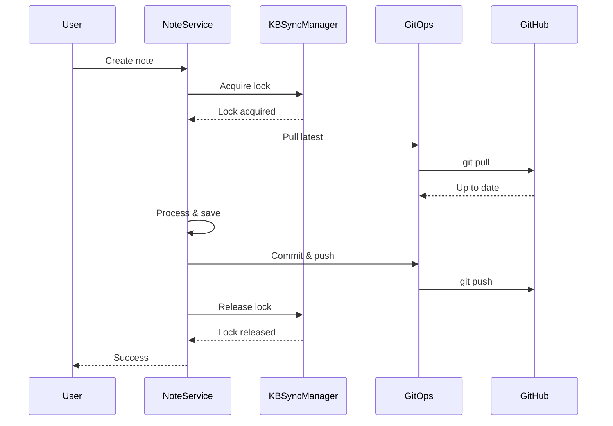
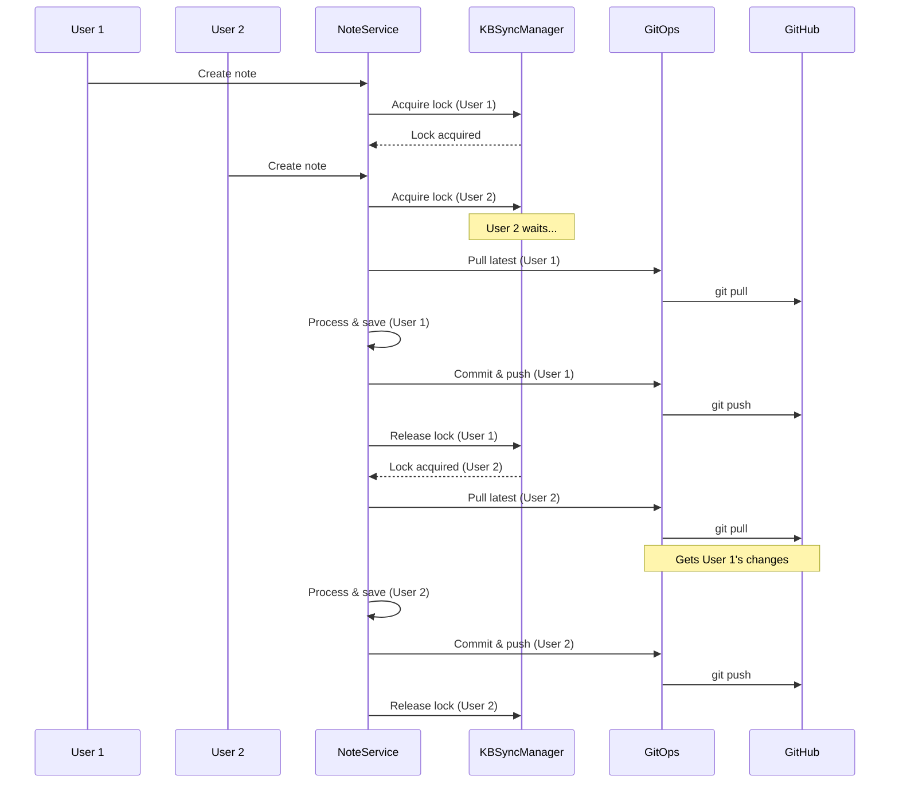

# KB Synchronization Architecture

This document describes the synchronization mechanism for knowledge base operations when multiple users work with the same KB.

---

## Problem Statement

When multiple users work with the same knowledge base (shared GitHub repository):

1. **Concurrent modifications** can lead to merge conflicts
2. **Race conditions** may cause lost updates
3. **Git conflicts** are difficult to resolve automatically
4. **Data consistency** must be maintained

---

## Solution: Operation Serialization + Git Pull

### Core Components

#### 1. KBSyncManager

Location: `src/knowledge_base/sync_manager.py`

**Purpose**: Serialize KB operations to prevent conflicts

**Features**:
- File-based locks (cross-process synchronization)
- Async locks (in-process synchronization)
- Per-KB locking (different KBs can be accessed in parallel)
- Singleton pattern for global coordination

**Usage**:
```python
from src.knowledge_base.sync_manager import get_sync_manager

sync_manager = get_sync_manager()

async with sync_manager.with_kb_lock(kb_path, "operation_name"):
    # Your KB operations here (create, update, delete)
    # Only one user can execute this block at a time for this KB
    pass
```

#### 2. GitOperations.pull()

Location: `src/knowledge_base/git_ops.py`

**Purpose**: Pull latest changes before KB operations

**Features**:
- Checks for uncommitted changes
- Validates remote configuration
- Detects merge conflicts
- Returns success status and message

**Usage**:
```python
git_ops = GitOperations(kb_path, enabled=True)
success, message = git_ops.pull(remote="origin", branch="main")

if not success:
    # Handle error (conflicts, network issues, etc.)
    print(f"Pull failed: {message}")
```

#### 3. NoteCreationService Integration

Location: `src/services/note_creation_service.py`

**Flow** (Note mode - `/note`):
```
1. User sends message
2. Acquire KB lock (wait if another user is working)
3. Pull latest changes from GitHub
4. Process message with agent
5. Save note to KB
6. Commit and push changes
7. Release KB lock
```

#### 4. AgentTaskService Integration

Location: `src/services/agent_task_service.py`

**Flow** (Agent mode - `/agent`):
```
1. User sends task request
2. Acquire KB lock (wait if another user is working)
3. Parse task and prepare context
4. Execute task with agent (may read/write KB files)
5. Return results to user
6. Release KB lock
```

**Note**: Agent mode uses the same KB locking mechanism as note mode to ensure safe concurrent access when multiple users interact with the same KB in agent mode.

---

## Synchronization Flow

### Single User Scenario



### Multi-User Scenario



---

## Lock Types

### File Lock (FileLock)

**Purpose**: Cross-process synchronization

**Location**: `.kb_operations.lock` in KB directory

**Characteristics**:
- Works across different Python processes
- Works across different machines (if KB is on shared filesystem)
- Timeout: 300 seconds (5 minutes)
- Automatically released on exception

### Async Lock (asyncio.Lock)

**Purpose**: In-process synchronization

**Characteristics**:
- Works within same Python process
- Prevents race conditions in async code
- No timeout (relies on file lock timeout)
- Acquired before file lock

### Lock Hierarchy

```
Acquire Async Lock
    ↓
Acquire File Lock
    ↓
Perform KB Operations
    ↓
Release File Lock
    ↓
Release Async Lock
```

**Why both?**
- Async lock: Fast, prevents issues in same process
- File lock: Slower, but works across processes/machines

---

## Error Handling

### Git Pull Failures

**Uncommitted changes**:
```
Error: "Repository has uncommitted changes"
Action: User must commit or stash manually
```

**Merge conflicts**:
```
Error: "Merge conflict during pull"
Action: User must resolve conflicts manually
```

**No remote configured**:
```
Error: "Remote 'origin' not found"
Action: Configure remote or work locally
```

**Remote branch doesn't exist**:
```
Warning: "Remote branch 'branch_name' doesn't exist on origin"
Action: Automatically creates branch locally and pushes to remote
```

### Lock Timeout

If a user's operation takes > 5 minutes:
- Lock automatically released
- Warning logged
- Next user can proceed

### Exception Handling

Locks are always released, even on exception:
```python
async with sync_manager.with_kb_lock(kb_path):
    # If exception occurs here
    raise SomeError()
    # Locks are still released properly
```

---

## Configuration

### Settings

```yaml
# Enable Git operations
KB_GIT_ENABLED: true

# Auto-push after commit (recommended for multi-user)
KB_GIT_AUTO_PUSH: true

# Remote and branch
KB_GIT_REMOTE: origin
KB_GIT_BRANCH: main
```

### Lock Timeout

Modify in `sync_manager.py`:
```python
FileLock(str(lock_file), timeout=300)  # 5 minutes
```

---

## Best Practices

### For Users

1. **Enable auto-push**: Ensures changes are immediately available to others
2. **Keep notes focused**: Shorter operations = less waiting
3. **Monitor for errors**: Check for pull/push failures

### For Developers

1. **Always use sync manager**: Never modify KB without lock
2. **Pull before operations**: Ensures latest version
3. **Handle pull errors**: Don't proceed if pull fails
4. **Keep operations atomic**: Complete entire operation within lock
5. **Log lock events**: Track who's waiting and why

### For System Administrators

1. **Monitor lock files**: Check for stale locks
2. **Set reasonable timeouts**: Balance between patience and responsiveness
3. **Use separate KBs**: For independent teams/projects
4. **Regular backups**: Even with synchronization, backups are essential

---

## Performance Considerations

### Lock Contention

- **Low contention** (few users): Negligible impact
- **High contention** (many users): Users may wait
- **Solution**: Use separate KBs per team/project

### Network Latency

- **Pull/push operations**: Depend on network speed
- **Lock waiting**: Not affected by network
- **Solution**: Use faster network or local-first workflow

### Lock File I/O

- **File lock overhead**: ~10-50ms
- **Async lock overhead**: ~1ms
- **Total overhead**: < 100ms per operation

---

## Testing

### Unit Tests

- `tests/test_kb_sync_manager.py`: Sync manager tests
- `tests/test_agent_task_service_kb_lock.py`: Agent mode KB locking tests
- `tests/test_git_ops.py`: Git operations tests

### Integration Tests

Simulate multi-user scenarios:
```python
async def test_concurrent_users():
    # Create two users
    # Both try to create notes simultaneously
    # Verify operations are serialized
    # Verify both notes are saved
```

**Agent Mode Locking Tests**:
```python
async def test_agent_tasks_serialized_for_same_kb():
    # Create two users with agent mode
    # Both try to execute tasks simultaneously on same KB
    # Verify operations are serialized
    # Verify both tasks complete successfully
```

---

## Future Improvements

1. **Optimistic locking**: Allow concurrent reads
2. **Lock queue visibility**: Show users their position in queue
3. **Automatic conflict resolution**: Smart merge for simple conflicts
4. **Lock analytics**: Track wait times and contention
5. **Distributed locks**: Support for multi-server deployments

---

## Related Documentation

- [Knowledge Base Setup](../user-guide/knowledge-base-setup.md)
- [Git Operations](../reference/git-operations.md)
- [Data Flow](data-flow.md)
