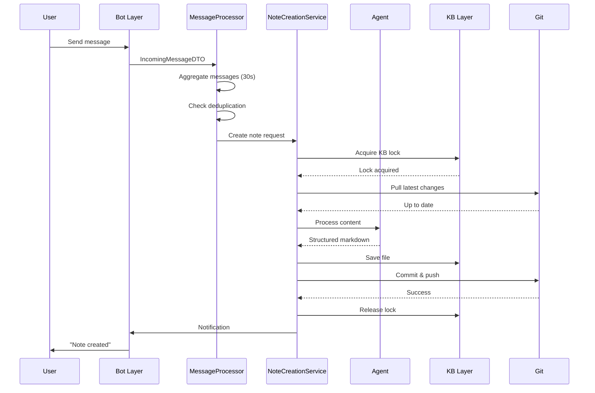
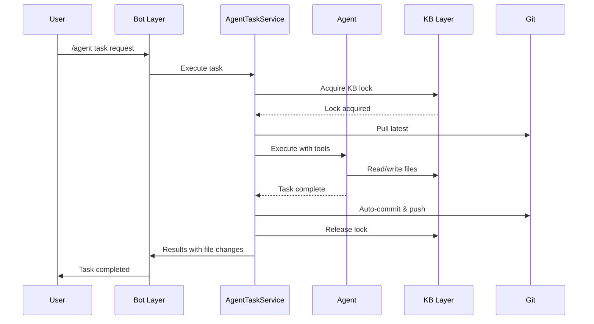
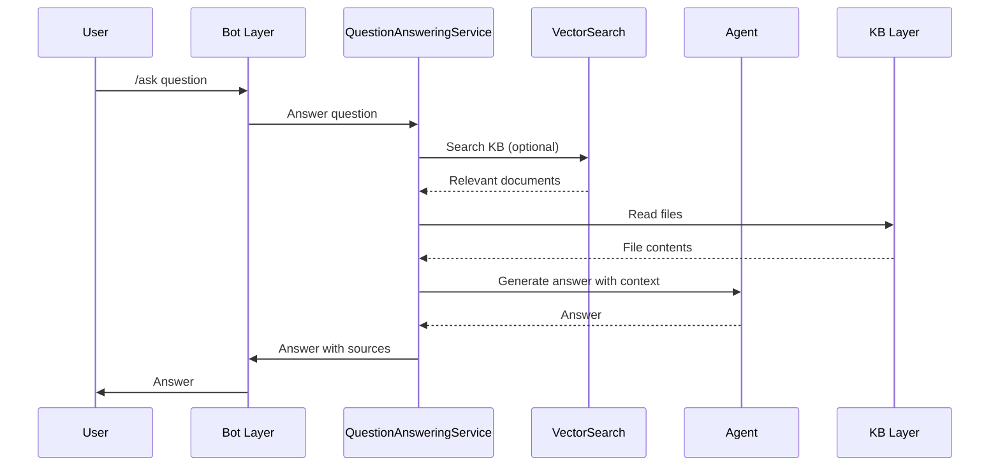

# Architecture Overview

## Introduction

**tg-note** is an intelligent knowledge base builder that transforms Telegram messages into structured markdown notes using AI agents. The system is built with a modular, event-driven architecture that prioritizes scalability, maintainability, and extensibility.

## Core Principles

### 1. **Separation of Concerns**

Each component has a well-defined responsibility:

- **Bot Layer**: Telegram-specific interface and event handling
- **Service Layer**: Business logic and workflow orchestration
- **Agent Layer**: AI-powered content analysis and generation
- **Knowledge Base Layer**: File system and Git operations
- **MCP Layer**: Tool integration and memory management

### 2. **Platform Independence**

Services are decoupled from Telegram using the DTO (Data Transfer Object) pattern, enabling:

- Easy migration to other messaging platforms (Discord, Slack, etc.)
- Better testability with mock objects
- Clear architectural boundaries

### 3. **Multi-User Support**

The system supports multiple users with:

- Per-user knowledge bases
- Shared knowledge base with synchronization
- Per-user settings and credentials
- Isolated memory storage

### 4. **Async-First Design**

All I/O operations are asynchronous for:

- Non-blocking message processing
- Concurrent user requests
- Better resource utilization
- Scalable architecture

## High-Level Architecture

```
┌──────────────────────────────────────────────────────────────┐
│                     Telegram Client                           │
│                    (User Interface)                           │
└───────────────────────────┬──────────────────────────────────┘
                            │
                            ▼
┌──────────────────────────────────────────────────────────────┐
│                      Bot Layer                                │
│  ┌─────────────────────────────────────────────────────┐     │
│  │ TelegramBotAdapter                                  │     │
│  │  - Event handling                                   │     │
│  │  - Message/command routing                          │     │
│  │  - User authentication                              │     │
│  └────────────┬────────────────────────────────────────┘     │
│               │                                               │
│  ┌────────────▼────────────────────────────────────────┐     │
│  │ Message Mapper                                      │     │
│  │  - DTO conversion (Telegram → Platform-independent) │     │
│  └────────────┬────────────────────────────────────────┘     │
└───────────────┼───────────────────────────────────────────────┘
                │
                ▼
┌──────────────────────────────────────────────────────────────┐
│                    Service Layer                              │
│  ┌─────────────────────────────────────────────────────┐     │
│  │ MessageProcessor                                    │     │
│  │  - Message grouping & aggregation                   │     │
│  │  - Deduplication                                    │     │
│  │  - Mode routing (note/ask/agent)                    │     │
│  └────┬─────────────┬──────────────┬───────────────────┘     │
│       │             │              │                          │
│  ┌────▼──────┐ ┌────▼──────┐ ┌────▼──────────────────┐      │
│  │Note       │ │Question   │ │Agent Task             │      │
│  │Creation   │ │Answering  │ │Service                │      │
│  │Service    │ │Service    │ │(full KB access)       │      │
│  └────┬──────┘ └────┬──────┘ └────┬──────────────────┘      │
└───────┼─────────────┼─────────────┼──────────────────────────┘
        │             │             │
        └─────────────┴─────────────┘
                      │
                      ▼
┌──────────────────────────────────────────────────────────────┐
│                     Agent Layer                               │
│  ┌─────────────────────────────────────────────────────┐     │
│  │ Agent Factory                                       │     │
│  │  - Agent selection (stub/qwen/autonomous)           │     │
│  └────────────┬────────────────────────────────────────┘     │
│               │                                               │
│  ┌────────────┴──────────────────┬──────────────────┐        │
│  │                               │                  │        │
│  ▼                               ▼                  ▼        │
│  ┌──────────────┐  ┌──────────────┐  ┌──────────────┐       │
│  │ StubAgent    │  │QwenCodeCLI   │  │Autonomous    │       │
│  │ (testing)    │  │Agent         │  │Agent         │       │
│  │              │  │(subprocess)  │  │(Python API)  │       │
│  └──────────────┘  └──────┬───────┘  └──────┬───────┘       │
│                           │                  │               │
│                           └────────┬─────────┘               │
│                                    │                         │
│  ┌─────────────────────────────────▼───────────────────┐    │
│  │ Tools                                               │    │
│  │  - File management                                  │    │
│  │  - Git operations                                   │    │
│  │  - Web search                                       │    │
│  │  - KB reading                                       │    │
│  │  - Vector search                                    │    │
│  │  - MCP tools (memory, custom)                       │    │
│  └─────────────────────────────────────────────────────┘    │
└──────────────────────────────────────────────────────────────┘
                      │
                      ▼
┌──────────────────────────────────────────────────────────────┐
│               Knowledge Base Layer                            │
│  ┌─────────────────────────────────────────────────────┐     │
│  │ Repository Manager                                  │     │
│  │  - KB initialization                                │     │
│  │  - User KB management                               │     │
│  │  - Path resolution                                  │     │
│  └────────────┬────────────────────────────────────────┘     │
│               │                                               │
│  ┌────────────▼────────────────────────────────────────┐     │
│  │ KB Sync Manager                                     │     │
│  │  - File locks (cross-process)                       │     │
│  │  - Async locks (in-process)                         │     │
│  │  - Operation serialization                          │     │
│  └────────────┬────────────────────────────────────────┘     │
│               │                                               │
│  ┌────────────▼────────────────────────────────────────┐     │
│  │ Git Operations                                      │     │
│  │  - Auto-commit                                      │     │
│  │  - Pull before operations                           │     │
│  │  - Push to remote                                   │     │
│  │  - Conflict detection                               │     │
│  └─────────────────────────────────────────────────────┘     │
└──────────────────────────────────────────────────────────────┘
                      │
                      ▼
┌──────────────────────────────────────────────────────────────┐
│                    MCP Layer                                  │
│  ┌─────────────────────────────────────────────────────┐     │
│  │ MCP Hub Service                                     │     │
│  │  - Built-in tools (memory)                          │     │
│  │  - Server registry                                  │     │
│  │  - HTTP/SSE API                                     │     │
│  │  - Config generation                                │     │
│  └────────────┬────────────────────────────────────────┘     │
│               │                                               │
│  ┌────────────▼────────────────────────────────────────┐     │
│  │ Memory Storage                                      │     │
│  │  - JSON storage (simple)                            │     │
│  │  - Vector storage (semantic search)                 │     │
│  │  - mem-agent storage (LLM-powered)                  │     │
│  └─────────────────────────────────────────────────────┘     │
└──────────────────────────────────────────────────────────────┘
```

## System Components

### Bot Layer

**Purpose**: Interface between Telegram and the application

**Key Components**:

- `TelegramBotAdapter`: Main bot class, handles Telegram API
- `BotHandlers`: Command and message handlers
- `MessageMapper`: Converts Telegram messages to DTOs
- `SettingsHandlers`: Interactive settings management UI
- `KBHandlers`: Knowledge base management UI
- `MCPHandlers`: MCP server management UI
- `CredentialsHandlers`: Secure credentials management

**Responsibilities**:

- Receive and send Telegram messages
- Handle commands (`/start`, `/note`, `/ask`, `/agent`, etc.)
- Manage interactive button menus
- Convert Telegram types to platform-independent DTOs
- User authentication and authorization

**See Also**: [Message DTO Architecture](message-dto.md)

### Service Layer

**Purpose**: Business logic and workflow orchestration

**Key Components**:

- `MessageProcessor`: Routes messages to appropriate services
- `NoteCreationService`: Creates structured notes from messages
- `QuestionAnsweringService`: Answers questions about KB content
- `AgentTaskService`: Executes autonomous agent tasks
- `BaseKBService`: Common KB operations (Git, rate limiting, formatting)
- `UserContextManager`: Manages conversation context per user

**Responsibilities**:

- Message aggregation and grouping (30s timeout)
- Deduplication (prevent processing same content twice)
- Mode management (note/ask/agent)
- KB synchronization (acquire locks)
- Git operations (pull, commit, push)
- Agent invocation
- User notification

**See Also**: [Service Refactoring](service-refactoring.md), [KB Synchronization](kb-synchronization.md)

### Agent Layer

**Purpose**: AI-powered content analysis and generation

**Key Components**:

- `AgentFactory`: Creates agent instances based on configuration
- `StubAgent`: Simple testing agent
- `QwenCodeCLIAgent`: Qwen Code CLI integration (subprocess)
- `AutonomousAgent`: Python-based OpenAI-compatible agent
- **Tools**: File management, Git, GitHub, web search, KB reading, vector search, MCP tools

**Responsibilities**:

- Analyze message content
- Generate structured markdown
- Categorize content (topics)
- Execute tasks (in agent mode)
- Use tools (web search, Git, file management, etc.)
- Memory management (via MCP)

**See Also**: [Agent Architecture](agent-architecture.md)

### Knowledge Base Layer

**Purpose**: File system and Git operations

**Key Components**:

- `RepositoryManager`: Manages multiple user KBs
- `KBSyncManager`: Cross-process synchronization
- `GitOperations`: Git automation
- `CredentialsManager`: Secure per-user Git credentials

**Responsibilities**:

- Initialize KB directories
- Manage file operations (create, update, delete)
- Git operations (commit, pull, push)
- Branch management
- Conflict detection
- Credential management (encrypted tokens)

**See Also**: [KB Synchronization](kb-synchronization.md), [Storage Paths](storage-paths.md)

### MCP Layer

**Purpose**: Tool integration and memory management

**Key Components**:

- `MCPHubService`: Unified gateway for MCP tools
- `MCPServerManager`: Manages MCP Hub lifecycle
- `MCPServersRegistry`: External MCP server registry
- `MemoryStorage`: Memory storage implementations (JSON, Vector, mem-agent)
- `MCPClient`: HTTP/SSE client for MCP protocol

**Responsibilities**:

- Provide built-in MCP tools (memory)
- Manage external MCP servers
- HTTP/SSE API endpoints
- Per-user memory isolation
- Configuration generation

**See Also**: [MCP Architecture](mcp-architecture.md), [Storage Paths](storage-paths.md)

## Core Workflows

### 1. Note Creation Workflow



### 2. Agent Task Workflow



### 3. Question Answering Workflow



## Deployment Modes

### Standalone Mode

```
┌────────────────────────────────┐
│         Python Process          │
│  ┌──────────────────────────┐  │
│  │     Bot Service          │  │
│  └──────────┬───────────────┘  │
│             │                   │
│  ┌──────────▼───────────────┐  │
│  │   MCP Hub (subprocess)   │  │
│  │   - Built-in tools       │  │
│  │   - Memory storage       │  │
│  └──────────────────────────┘  │
└────────────────────────────────┘
```

**Characteristics**:

- Single Python process
- MCP Hub launched as subprocess
- Suitable for single-user deployments
- Easy development and testing

### Docker Mode

```
┌─────────────────────┐       ┌─────────────────────┐
│   Bot Container     │       │  MCP Hub Container  │
│   - Pure client     │◄──────┤  - Standalone       │
│   - Connects via    │ HTTP  │  - Built-in tools   │
│     MCP_HUB_URL     │       │  - Memory storage   │
└─────────────────────┘       └─────────────────────┘
            │
            │ (Optional)
            ▼
┌─────────────────────┐
│  vLLM/SGLang        │
│  (GPU backend)      │
│  - For mem-agent    │
└─────────────────────┘
```

**Characteristics**:

- Multi-container deployment
- MCP Hub as standalone service
- Bot is pure client
- Scalable architecture
- Suitable for production

**See Also**: [Docker Deployment](../deployment/docker.md)

## Configuration Architecture

### Settings Hierarchy

```
Environment Variables (highest priority)
    ↓
.env File
    ↓
config.yaml (global settings)
    ↓
User Overrides (per-user via Telegram)
    ↓
Default Values (lowest priority)
```

### Configuration Flow

```
┌──────────────────────┐
│  Settings Manager    │
│  (Pydantic)          │
└──────────┬───────────┘
           │
           ▼
┌──────────────────────┐
│  User Settings       │
│  Manager             │
│  (per-user overrides)│
└──────────┬───────────┘
           │
           ▼
┌──────────────────────┐
│  Settings Handlers   │
│  (Telegram UI)       │
└──────────────────────┘
```

**See Also**: [Settings Architecture](settings-architecture.md), [User Guide: Settings Management](../user-guide/settings-management.md)

## Data Storage

### Directory Structure

```
tg-note/
├── config.yaml                    # Global settings
├── .env                           # Credentials (git-ignored)
├── data/
│   ├── memory/
│   │   ├── user_123/              # User 123's memory (isolated)
│   │   │   ├── memories.json
│   │   │   └── vector_store/
│   │   └── user_456/              # User 456's memory (isolated)
│   ├── mcp_servers/
│   │   ├── weather-api.json       # Shared MCP server
│   │   └── user_123/              # User 123's MCP servers
│   │       └── custom.json
│   ├── processed.json             # Global deduplication tracker
│   └── user_settings_overrides.json  # Per-user settings
├── logs/
│   ├── bot.log                    # Bot logs
│   └── mcp_hub.log                # MCP Hub logs
└── knowledge_bases/
    ├── user_123_kb/               # User 123's KB
    └── user_456_kb/               # User 456's KB
```

**See Also**: [Storage Paths Architecture](storage-paths.md)

## Security

### 1. User Authentication

- Telegram user ID as primary identifier
- Optional allowed user list (`ALLOWED_USER_IDS`)
- Per-user resource isolation

### 2. Credentials Management

- Encrypted storage (AES-128 Fernet)
- Per-user Git credentials
- Auto-delete sensitive messages
- No credentials in logs

### 3. File System Security

- Path validation (prevent path traversal)
- Git operations restricted to KB directory
- File lock mechanisms
- Safe branch operations

### 4. API Security

- Rate limiting per user
- Timeout handling
- Input validation
- Error sanitization

## Performance Considerations

### Async Operations

- All I/O operations are async
- Non-blocking message processing
- Concurrent user requests

### Caching

- Agent instance caching per user
- MCP client connection pooling
- Settings cache

### Rate Limiting

- Per-user rate limits
- Configurable thresholds
- Graceful degradation

### Lock Management

- File locks for cross-process sync
- Async locks for in-process sync
- Timeout handling (5 minutes default)
- Automatic lock release on error

## Error Handling

### Graceful Degradation

- Agent failures don't crash the bot
- Git failures are logged and reported
- Lock timeouts are handled
- MCP failures fall back to core functionality

### User Notifications

- Clear error messages
- Recovery suggestions
- Support information

### Logging

- Structured logging (Loguru)
- Multiple log levels (DEBUG, INFO, WARNING, ERROR, CRITICAL)
- File and console output
- Request tracing

## Extensibility

### Adding New Agents

1. Implement `BaseAgent` interface
2. Register in `AgentFactory`
3. Add configuration options
4. Update documentation

### Adding New Tools

1. Implement tool class
2. Register in tool registry
3. Add to agent configuration
4. Document tool usage

### Adding New Services

1. Inherit from `BaseKBService` (if KB-related)
2. Implement service interface
3. Register in service container
4. Wire in message processor

### Adding New MCP Servers

1. Create server configuration JSON
2. Place in `data/mcp_servers/`
3. Configure connection details
4. Test via `/mcp list` command

## Testing Strategy

### Unit Tests

- Individual components
- Mock dependencies
- Fast execution
- High coverage

### Integration Tests

- Multi-component workflows
- Real dependencies
- KB operations
- Git operations

### End-to-End Tests

- Full user workflows
- Telegram integration
- Agent integration
- MCP integration

**See Also**: [Testing Guide](../development/testing.md)

## Monitoring & Observability

### Metrics

- Message processing rate
- Agent response time
- KB operation latency
- Error rates

### Logs

- Structured logging
- Request tracing
- Error tracking
- Performance profiling

### Health Checks

- Bot status (`/status`)
- MCP Hub health (`/health`)
- Git connectivity
- Agent availability

## Related Documentation

- [Agent Architecture](agent-architecture.md) - Detailed agent system design
- [Data Flow](data-flow.md) - Step-by-step data flow through the system
- [MCP Architecture](mcp-architecture.md) - MCP layer design
- [Service Refactoring](service-refactoring.md) - Service layer design patterns
- [KB Synchronization](kb-synchronization.md) - Multi-user KB synchronization
- [Message DTO](message-dto.md) - Platform-independent messaging
- [Settings Architecture](settings-architecture.md) - Configuration management
- [Storage Paths](storage-paths.md) - Data storage organization
