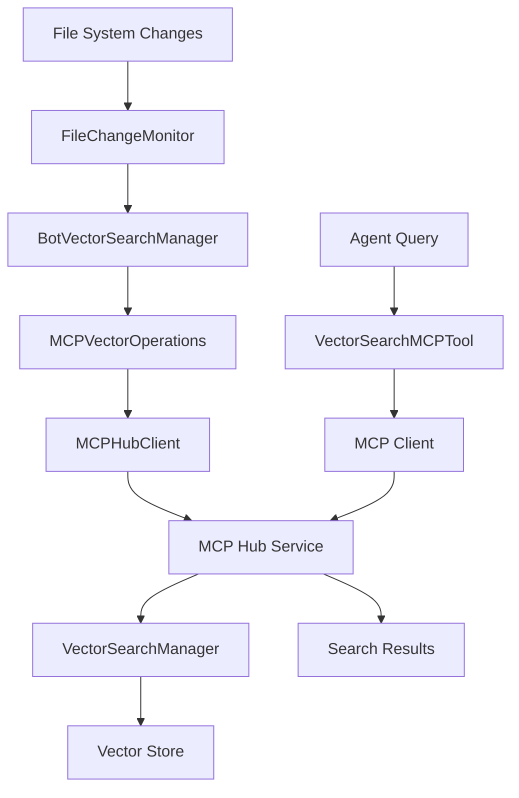

# Vector Search Architecture

## Overview

The vector search system provides semantic search capabilities for the knowledge base using embedding models and vector stores. The architecture follows SOLID principles with clear separation of concerns.

## Components

### 1. MCP Client (`src/mcp/client.py`)

**Responsibility**: Communication with MCP servers via stdio or HTTP/SSE transport.

**Key Features**:
- Supports both stdio and HTTP/SSE transport modes
- Handles JSON-RPC 2.0 communication
- Manages connection lifecycle and reconnection
- Provides tools, resources, and prompts access

**Improvements Made**:
- Fixed resource leaks by explicitly closing SSE responses
- Added timeout handling for SSE reader initialization
- Improved retry logic to prevent infinite loops
- Better error handling and logging

### 2. Vector Search Manager (`src/mcp/vector_search/manager.py`)

**Responsibility**: Core vector search operations - indexing, searching, and managing documents.

**Key Features**:
- Document chunking and embedding
- Vector store operations (add, delete, update, search)
- Metadata management and consistency
- Configuration change detection

**Improvements Made**:
- Fixed inconsistent state by updating `_indexed_documents` only after successful storage
- Removed duplicate code in `update_documents`
- Better error handling for embedding operations

### 3. Bot Vector Search Manager (`src/bot/vector_search_manager.py`)

**Responsibility**: Coordinates vector search operations from the bot container.

**Key Features**:
- Monitors knowledge base changes
- Triggers indexing via MCP Hub API
- Manages file change detection
- Handles reactive reindexing

**Improvements Made**:
- Refactored to use separated components (FileChangeMonitor, MCPVectorOperations)
- Fixed race conditions in event handling
- Improved hash persistence logic (only save on success)
- Better error handling and logging

### 4. File Change Monitor (`src/bot/file_change_monitor.py`)

**Responsibility**: Monitors file system changes and detects modifications.

**Key Features**:
- Scans knowledge base directories
- Computes file hashes for change detection
- Detects added, modified, and deleted files
- Persists file state for comparison

### 5. MCP Vector Operations (`src/bot/mcp_vector_operations.py`)

**Responsibility**: Handles all communication with MCP Hub for vector operations.

**Key Features**:
- Reindex, add, delete, update operations
- Error handling and retry logic
- Availability checking
- Consistent interface for MCP operations

### 6. MCP Hub Client (`src/bot/mcp_hub_client.py`)

**Responsibility**: HTTP communication with MCP Hub service.

**Key Features**:
- Unified HTTP client for all MCP Hub operations
- Circuit breaker pattern for fault tolerance
- Exponential backoff retry logic
- Comprehensive error handling

**Improvements Made**:
- Added circuit breaker for protection against cascading failures
- Improved retry logic with different strategies for different error types
- Better session management
- Enhanced logging and metrics

### 7. Circuit Breaker (`src/core/circuit_breaker.py`)

**Responsibility**: Provides fault tolerance and prevents cascading failures.

**Key Features**:
- Configurable failure thresholds
- Automatic recovery testing
- State management (CLOSED, OPEN, HALF_OPEN)
- Thread-safe operations

## Data Flow



## Error Handling Strategy

### 1. Circuit Breaker Pattern
- Prevents cascading failures when MCP Hub is unavailable
- Automatic recovery testing after timeout
- Configurable failure thresholds

### 2. Retry Logic
- Exponential backoff for retryable errors
- Different strategies for different error types
- Maximum retry attempts to prevent infinite loops

### 3. State Consistency
- Only update metadata after successful operations
- Rollback on failures to maintain consistency
- Proper cleanup of resources

## Configuration

### Environment Variables
- `MCP_HUB_URL`: MCP Hub service URL
- `VECTOR_SEARCH_ENABLED`: Enable/disable vector search
- `MCP_TIMEOUT`: Request timeout in seconds

### Circuit Breaker Settings
- `failure_threshold`: Number of failures before opening circuit (default: 5)
- `recovery_timeout`: Time to wait before testing recovery (default: 60s)

## Monitoring and Metrics

### Key Metrics
- Search success rate
- Average MCP call duration
- Circuit breaker state
- File change detection frequency
- Error rates by operation type

### Logging
- Structured logging with consistent format
- Different log levels for different operations
- Error context and stack traces
- Performance metrics

## Best Practices

### 1. Error Handling
- Always handle exceptions gracefully
- Provide meaningful error messages
- Log errors with sufficient context
- Use circuit breaker for external services

### 2. State Management
- Update state only after successful operations
- Use transactions where possible
- Implement proper rollback mechanisms
- Validate state consistency

### 3. Performance
- Use connection pooling for HTTP clients
- Implement proper caching strategies
- Monitor resource usage
- Optimize database queries

### 4. Testing
- Unit tests for all components
- Integration tests for MCP communication
- Load testing for performance validation
- Error scenario testing

## Troubleshooting

### Common Issues

1. **Circuit Breaker Open**
   - Check MCP Hub service availability
   - Review error logs for root cause
   - Wait for recovery timeout or reset manually

2. **Inconsistent State**
   - Check metadata consistency
   - Verify file hash persistence
   - Consider full reindex if needed

3. **Performance Issues**
   - Monitor circuit breaker state
   - Check retry patterns
   - Review resource usage

### Debug Commands
```bash
# Check circuit breaker state
curl http://mcp-hub:8765/health

# View logs
docker logs bot-container

# Check file hashes
cat data/vector_search_hashes.json
```

## Future Improvements

1. **Metrics Collection**
   - Prometheus metrics integration
   - Grafana dashboards
   - Alerting rules

2. **Caching**
   - Redis caching for search results
   - File hash caching
   - Configuration caching

3. **Scalability**
   - Horizontal scaling support
   - Load balancing
   - Database sharding

4. **Monitoring**
   - Health check endpoints
   - Performance monitoring
   - Error tracking