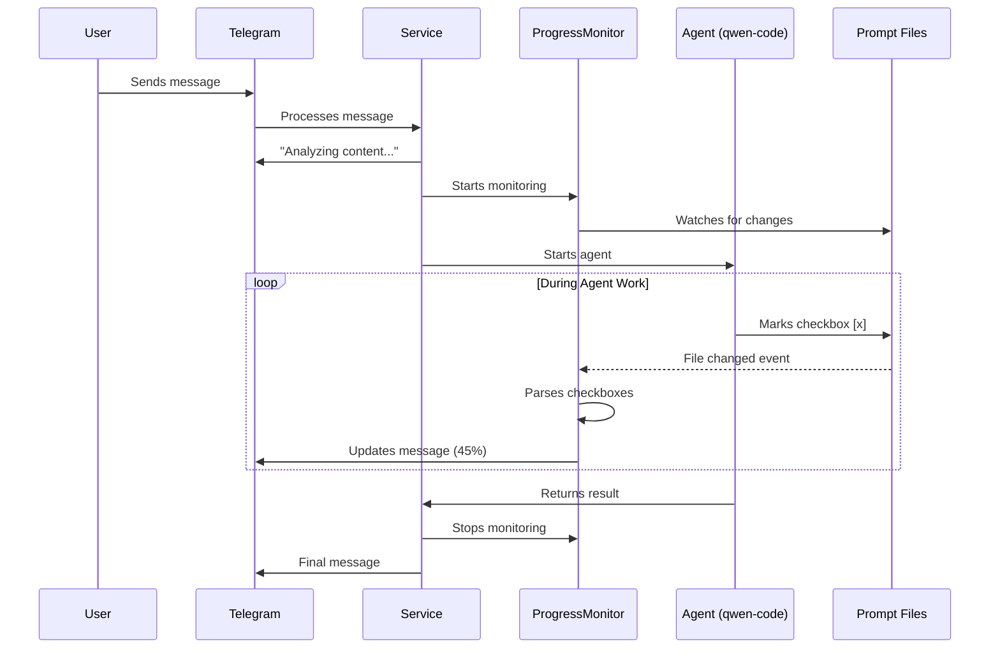

# Progress Tracking

Real-time progress tracking for agent tasks shows checkbox completion status in Telegram messages while agents work.

## Overview

The progress tracking system monitors agent prompt files where the agent marks checkboxes as completed during execution. It automatically updates the Telegram status message to show progress in real-time.

## Features

- **Real-time Updates**: Telegram message updates as agent completes tasks
- **Checkbox Monitoring**: Tracks `- [ ]` (pending) and `- [x]` (completed) checkboxes
- **Context-Aware**: Shows task names with their parent section headers
- **Throttled Updates**: Limits updates to once every 2 seconds to avoid rate limits
- **Graceful Errors**: Continues working even if monitoring fails

## How It Works



## File-First Approach

The system works with the file-first prompt architecture:

1. **Prompt Export**: Promptic exports prompts to `data/prompts/` with `render_mode="file_first"`
2. **Agent Reads**: Agent (qwen-code CLI) reads exported files using `--include-directories`
3. **Agent Writes**: Agent marks checkboxes in prompt files as it completes tasks
4. **Monitor Detects**: ProgressMonitor uses watchdog to detect file changes
5. **UI Updates**: Telegram message updates with current progress

## Configuration

### Enable/Disable Progress Tracking

Set in `.env` or YAML config:

```bash
ENABLE_PROGRESS_TRACKING=true  # Default: true
```

Or via Telegram command:

```
/settings
```

Navigate to: **Processing** → **Enable Progress Tracking** → On/Off

### Throttle Interval

Progress updates are throttled to avoid Telegram rate limits. Default: 2 seconds.

To change (in code):

```python
monitor = ProgressMonitor(
    export_dir=export_dir,
    update_callback=callback,
    throttle_interval=3.0  # 3 seconds
)
```

## Message Format

Progress messages show:

```
🔄 Обрабатываю контент... (45%)

Шаг 1: Анализ
✅ Прочитать контент
✅ Определить тип
⏳ Проанализировать структуру...
⬜ Создать файлы
⬜ Обновить индекс

... и еще 5 задач
```

Legend:
- ✅ Completed task
- ⏳ Current task (in progress)
- ⬜ Pending task

## Supported Checkbox Formats

The parser recognizes these checkbox formats:

```markdown
- [ ] Pending task
- [x] Completed task (lowercase)
- [X] Completed task (uppercase)
```

## Context Extraction

Checkboxes inherit context from parent headers:

```markdown
## Шаг 1: Анализ

- [x] Task A  # Context: "Шаг 1: Анализ"
- [ ] Task B  # Context: "Шаг 1: Анализ"

## Шаг 2: Обработка

- [ ] Task C  # Context: "Шаг 2: Обработка"
```

## Implementation Details

### Architecture

**Components:**

1. **ProgressMonitor** (`src/services/progress_monitor.py`)
   - File system monitoring with watchdog
   - Checkbox parsing with regex
   - Progress calculation
   - Throttling and debouncing
   - Thread-safe coroutine scheduling (v0.2.2+)

2. **BaseKBService Integration** (`src/services/base_kb_service.py`)
   - `_start_progress_monitoring()` - creates and starts monitor
   - `_update_progress_message()` - updates Telegram message
   - `_format_progress_text()` - formats progress for display

3. **Service Integration**
   - **NoteCreationService**: Monitors `data/prompts/note_mode/`
   - **AgentTaskService**: Monitors `data/prompts/agent_mode/`

4. **Agent Prompt Instructions** (v0.2.2+)
   - Explicit reminders to update checkboxes immediately after each step
   - ✅ markers after each action item
   - Prevents batch updates at the end
   - Improves real-time progress visibility

### Checkbox Parsing

Regular expressions used:

```python
# Headers (## or ###)
header_pattern = re.compile(r"^(#{2,})\s+(.+)$")

# Checkboxes (- [ ] or - [x])
checkbox_pattern = re.compile(r"^-\s*\[([ xX])\]\s+(.+)$")
```

### Error Handling

The system is designed for graceful degradation:

- **Monitor fails to start**: Logs warning, continues without progress tracking
- **File parsing fails**: Logs error, skips that file
- **Telegram update fails**: Logs error, continues monitoring
- **Watchdog crashes**: Catches exception, stops monitoring

This ensures the main agent workflow continues even if progress tracking has issues.

## Performance

### Resource Usage

- **CPU**: Minimal (watchdog is event-driven)
- **Memory**: ~5-10 MB per monitor
- **File I/O**: Only when files change (not polling)

### Throttling

Updates are throttled to:
- **Minimum interval**: 2 seconds between updates
- **Debouncing**: Groups rapid changes into single update
- **Rate limit protection**: Respects Telegram API limits

### Scalability

- Multiple users: Each has own monitor instance
- Multiple files: Single monitor watches all files in directory
- Large prompts: Only changed files are re-parsed

## Troubleshooting

### Progress not updating

**Check:**

1. Is `ENABLE_PROGRESS_TRACKING=true`?
2. Are prompt files exported to `data/prompts/`?
3. Is agent writing to files (check `data/prompts/*/`)?
4. Check logs for monitor errors

**Enable debug logging:**

```python
# In config/logging_config.py
LOG_LEVEL=DEBUG
```

### Thread safety error (Fixed in v0.2.2)

**Symptom:** Exception in watchdog thread:

```
Exception in thread Thread-2:
  File "/app/src/services/progress_monitor.py", line 204, in _on_file_changed
    self._update_task = asyncio.create_task(self._debounced_update())
  File "/usr/local/lib/python3.11/asyncio/tasks.py", line 381, in create_task
    loop = events.get_running_loop()
RuntimeError: no running event loop
```

**Cause:** `asyncio.create_task()` was called from watchdog's synchronous callback which runs in a separate thread without an event loop.

**Fix:** Use `asyncio.run_coroutine_threadsafe()` to schedule coroutines from watchdog thread to the main event loop.

**Commit:** `v0.2.2` - Thread-safe progress monitoring

### Updates too slow

**Adjust throttle interval:**

```python
# In BaseKBService._start_progress_monitoring()
throttle_interval=1.0  # Faster updates (may hit rate limits)
```

### Memory usage high

**Multiple monitors running?**

- Check that monitors are stopped after agent completes
- Look for exceptions preventing `finally` blocks from executing

## Examples

### Manual Progress Monitoring

```python
from pathlib import Path
from src.services.progress_monitor import ProgressMonitor, ProgressSnapshot

async def my_callback(snapshot: ProgressSnapshot):
    print(f"Progress: {snapshot.percentage:.0f}%")
    print(f"Current: {snapshot.current_task}")

# Create monitor
monitor = ProgressMonitor(
    export_dir=Path("data/prompts/my_mode"),
    update_callback=my_callback,
    throttle_interval=2.0
)

# Start monitoring
await monitor.start_monitoring()

# ... agent works ...

# Stop monitoring
await monitor.stop_monitoring()
```

### Custom Progress Formatter

```python
def format_progress_minimal(snapshot: ProgressSnapshot) -> str:
    """Minimal progress format"""
    return f"⏳ {snapshot.completed}/{snapshot.total} tasks"

# Use in _format_progress_text()
```

## Testing

### Run Tests

```bash
# Run progress monitor tests
pytest tests/test_progress_monitor.py -v

# Run with coverage
pytest tests/test_progress_monitor.py --cov=src.services.progress_monitor
```

### Test Coverage

The test suite includes:

- ✅ Checkbox parsing (basic, uppercase, empty)
- ✅ Progress calculation
- ✅ File monitoring and change detection
- ✅ Throttling verification
- ✅ Multiple file handling
- ✅ Edge cases (malformed markdown, nonexistent dirs)
- ✅ Error handling

## Best Practices

### For Agent Prompt Authors

When creating prompts with checkboxes:

1. **Explicit Instructions**: Add clear reminders to update checkboxes immediately
2. **Visual Markers**: Use ✅ emoji to emphasize checkbox update points
3. **Step-by-Step**: Break down complex tasks into granular checkboxes
4. **Context**: Include checkbox context (parent headers) for clarity
5. **Format Consistency**: Use standard `- [ ]` and `- [x]` format

Example:

```markdown
## Шаг 1: Анализ

- [ ] Прочитать входящий контент
- [ ] Определить тип источника
- ✅ ЗАКРОЙ ЧЕКБОКС СРАЗУ после определения типа
```

### For Users

- Enable progress tracking in settings for real-time updates
- Longer tasks show more detailed progress
- Progress updates respect Telegram rate limits (throttled to 2s)

## Future Enhancements

Potential improvements:

1. **Progress persistence**: Save progress to disk for resume
2. **Estimated time**: Calculate ETA based on completion rate
3. **Sub-task tracking**: Track nested checkboxes (indented)
4. **Progress graphs**: Visual progress bars in Telegram
5. **Webhook notifications**: External progress notifications
6. **Multi-agent**: Track multiple agents simultaneously

## Related Documentation

- [Agent Architecture](../architecture/agent-architecture.md)
- [Prompt System](../architecture/prompt-system.md)
- [QwenCodeCLI Agent](../agents/qwen-code-cli.md)

## References

- [watchdog documentation](https://python-watchdog.readthedocs.io/)
- [Telegram Bot API - editMessageText](https://core.telegram.org/bots/api#editmessagetext)
