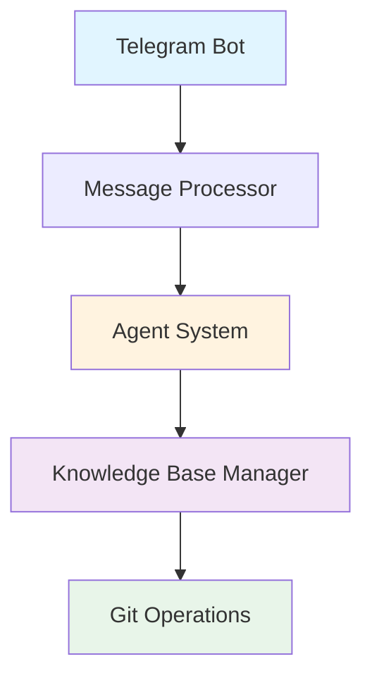

# Welcome to tg-note Documentation

<div align="center">

**Intelligent Knowledge Base Builder**

Telegram bot that automatically transforms your messages, reposts, and articles into a structured knowledge base using AI agents.

[](https://opensource.org/licenses/MIT)
[](https://www.python.org/downloads/)

[Get Started](getting-started/quick-start.md){ .md-button .md-button--primary }
[View on GitHub](https://github.com/ArtyomZemlyak/tg-note){ .md-button }

</div>

---

## What is tg-note?

**tg-note** is a Telegram bot that acts as your personal knowledge curator. It receives messages, reposts, and articles through Telegram, analyzes them using AI agent systems, and automatically saves the important information to your GitHub-based knowledge base in structured Markdown format.

Perfect for:

- 📚 Building a personal knowledge base from Telegram channels
- 🔬 Organizing research papers and scientific articles
- 📰 Archiving news and insights from multiple sources
- 🧠 Creating a searchable second brain

---

## Key Features

<div class="grid cards" markdown>

- :robot:{ .lg .middle } **AI-Powered Analysis**

    ---

    Intelligent content categorization and structuring using advanced agent systems

- :memo:{ .lg .middle } **Automatic Markdown**

    ---

    Converts any content into well-formatted Markdown files with proper structure

- :file_folder:{ .lg .middle } **Smart Organization**

    ---

    Automatic categorization by topics (AI, biology, physics, tech, etc.)

- :material-github:{ .lg .middle } **GitHub Integration**

    ---

    Direct commits to your knowledge base repository with version control

- :busts_in_silhouette:{ .lg .middle } **Multi-User Support**

    ---

    Each user can have their own personal knowledge base

- :gear:{ .lg .middle } **Flexible Configuration**

    ---

    Configure bot settings directly via Telegram commands

- :search:{ .lg .middle } **Vector Search**

    ---

    Semantic search through your knowledge base using AI embeddings

- :lock:{ .lg .middle } **Secure Credentials**

    ---

    Personal encrypted Git tokens for each user via Telegram

</div>

---

## Quick Start

Get started with tg-note in just a few minutes:

=== "1. Installation"

    ```bash
    git clone https://github.com/ArtyomZemlyak/tg-note.git
    cd tg-note
    poetry install
    ```

=== "2. Configuration"

    ```bash
    # Copy configuration files
    cp config.example.yaml config.yaml

    # Add your Telegram bot token to .env
    echo "TELEGRAM_BOT_TOKEN=your_token_here" > .env
    ```

=== "3. Run"

    ```bash
    poetry run python main.py
    ```

[Full Installation Guide →](getting-started/installation.md){ .md-button }

---

## Agent Types

Choose the right agent for your needs:

### :material-robot-outline: Qwen Code CLI (Recommended)

Uses [Qwen Code CLI](https://github.com/QwenLM/qwen-code) for advanced AI processing.

- ✅ Full integration with Qwen3-Coder models
- ✅ Automatic TODO planning
- ✅ Built-in tools: web search, git, github, shell
- ✅ Free tier: 2000 requests/day

[Learn More →](agents/qwen-code-cli.md)

### :material-brain: Autonomous Agent

Python-based agent with OpenAI-compatible API support.

- ✅ OpenAI-compatible API integration
- ✅ Autonomous planning and decision-making
- ✅ Function calling support
- ✅ Works with various LLM providers

[Learn More →](agents/autonomous-agent.md)

### :material-test-tube: Stub Agent

Simple stub agent for testing and MVP.

- ⚡ Fast and lightweight
- 🔧 No external dependencies
- 🧪 Perfect for testing

[Learn More →](agents/stub-agent.md)

---

## Architecture Overview



[Detailed Architecture →](architecture/overview.md)

---

## New Features

<div class="grid cards" markdown>

- :search:{ .lg .middle } **Vector Search**

    ---

    Semantic search through your knowledge base using AI embeddings. Find relevant content by meaning, not just keywords.

    [:octicons-arrow-right-24: Learn More](architecture/vector-search-overview.md)

- :lock:{ .lg .middle } **Secure Git Credentials**

    ---

    Each user can securely add their personal GitHub/GitLab tokens directly through Telegram with encryption.

    [:octicons-arrow-right-24: Setup Guide](user-guide/secure-git-credentials.md)

- :material-docker:{ .lg .middle } **Docker Vector Search**

    ---

    Complete Docker setup with Qdrant vector database and Infinity embeddings service.

    [:octicons-arrow-right-24: Quick Start](getting-started/vector-search-quickstart.md)

</div>

---

## Documentation Sections

<div class="grid cards" markdown>

- :rocket:{ .lg .middle } **Getting Started**

    ---

    Installation, configuration, and first steps

    [:octicons-arrow-right-24: Start Here](getting-started/quick-start.md)

- :book:{ .lg .middle } **User Guide**

    ---

    Commands, content management, and settings

    [:octicons-arrow-right-24: Read Guide](user-guide/bot-commands.md)

- :material-brain:{ .lg .middle } **Agent System**

    ---

    AI agents, tools, and autonomous processing

    [:octicons-arrow-right-24: Explore Agents](agents/overview.md)

- :material-floor-plan:{ .lg .middle } **Architecture**

    ---

    System design and component details

    [:octicons-arrow-right-24: View Architecture](architecture/overview.md)

- :hammer_and_wrench:{ .lg .middle } **Development**

    ---

    Contributing, testing, and code quality

    [:octicons-arrow-right-24: Start Contributing](development/contributing.md)

- :material-cloud-upload:{ .lg .middle } **Deployment**

    ---

    Production setup, Docker, and CI/CD

    [:octicons-arrow-right-24: Deploy](deployment/production.md)

</div>

---

## Community & Support

- :octicons-mark-github-16: [GitHub Repository](https://github.com/ArtyomZemlyak/tg-note)
- :octicons-issue-opened-16: [Issue Tracker](https://github.com/ArtyomZemlyak/tg-note/issues)
- :octicons-comment-discussion-16: [Discussions](https://github.com/ArtyomZemlyak/tg-note/discussions)

---

## License

This project is licensed under the MIT License - see the [LICENSE](https://github.com/ArtyomZemlyak/tg-note/blob/main/LICENSE) file for details.

---

<div align="center">

**Built with ❤️ by [Artem Zemliak](https://github.com/ArtyomZemlyak)**

⭐ Star this repository if you find it helpful!

</div>
