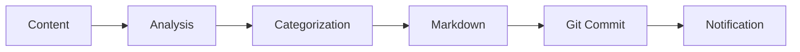

# Working with Content

Learn how to work with different types of content in tg-note.

---

## Supported Content Types

- ✅ Text messages
- ✅ Forwarded messages from channels
- ✅ Photos with captions  
- ✅ Documents
- ✅ Links and URLs
- ✅ Multiple consecutive messages

---

## Sending Text Messages

Simply send any text to save it:

```
This is an interesting article about AI...
```

The bot will:

1. Receive your message
2. Analyze the content
3. Categorize it
4. Save as Markdown
5. Commit to Git

---

## Forwarding Messages

Forward messages from any chat or channel:

1. Find the message
2. Tap **Forward**
3. Select your tg-note bot

Works with:

- Channel posts
- Group messages  
- Media with captions
- Links

---

## Sending Multiple Messages

Send consecutive messages for automatic grouping:

```
First message...
(wait)
Second message...
(wait)
Third message...
```

Messages sent within 30 seconds (configurable) are grouped into one note.

---

## Sending Links

Send article URLs:

```
https://arxiv.org/abs/12345
```

With Qwen Code CLI, the bot will:

- Fetch the article
- Analyze content
- Extract key info
- Save structured note

---

## Processing Workflow



---

## Output Structure

Your KB will have this structure:

```
knowledge_base/
├── topics/
│   ├── ai/
│   │   └── 2025-10-03-neural-networks.md
│   ├── biology/
│   │   └── 2025-10-03-crispr.md
│   └── physics/
│       └── 2025-10-03-quantum.md
└── index.md
```

---

## See Also

- [Bot Commands](bot-commands.md)
- [Knowledge Base Setup](knowledge-base-setup.md)

---

## Connections and Summaries

- The bot now shows a Connections section (Связи) after processing.
- New files created in the same run are excluded from Connections to reduce noise.
- Each connection includes a brief explanation (derived from the target file title when available).
- In the summary of changes, file entries include GitHub links when your KB is linked to a GitHub remote and branch.

---

## Note Mode Best Practices (Качество заметок)

- **Атомарность**: одна заметка — один концепт/определение/процедура/решение; дробите сложные темы.
- **Дедупликация**: при совпадении по сути — обновляйте существующий файл, а не создавайте новый.
- **Фронтматтер**: добавляйте YAML с `title, category, subcategory?, tags[], sources[], synonyms[]`.
- **Связи**: 2–5 внутренних ссылок на уже существующие файлы с кратким объяснением.
- **Источники**: хотя бы один; указывайте точные URL/локаторы.
- **Ограничения**: не редактируйте `index.md` и корневой `README.md` без необходимости.
